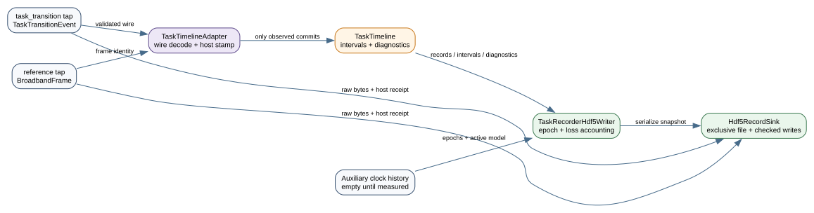

# Host task-recorder timeline

<!-- graphviz:apps/scifi2-hub-manager/docs/task-recorder-timeline.dot -->

<!-- /graphviz:apps/scifi2-hub-manager/docs/task-recorder-timeline.dot -->

`src/task_timeline.{hpp,cpp}` is the hardware-free host recorder boundary for T-32/H-22. It receives an immutable, value-owned copy of every committed `TaskTransitionEvent`; snapshots and accepted commands are deliberately not inputs. Each raw record retains the task-definition identity, app/run/event sequences, effective `BroadbandFrame` identity, proposal metadata, and the separate host receive timestamp.

Observed start and transition commits form half-open state intervals. An abort or reset closes the active interval. An event-sequence gap, duplicated or reordered event, source/frame regression, or explicit reference discontinuity is retained as a diagnostic and marks the affected timeline interval incomplete. The recorder never fills such a hole with a guessed transition.

`TaskTimeline::label` consumes the auxiliary sample's persisted affine-clock mapping interval. It emits a state label only when the entire uncertainty interval lies inside one complete task interval. Crossing either boundary is `ambiguous`; an unbounded clock, missing active state, or incomplete history also remains an explicit non-label.

`src/task_timeline_adapter.{hpp,cpp}` connects the two authoritative wire streams to this value boundary. It reuses the producer-side `validate_task_transition_event` contract so the recorder refuses exactly what the App refuses to publish, translates the wire `TaskEventKind`/`TaskTriggerKind` enums into the value-layer kind and a stable canonical trigger string, and stamps a host receive time on receipt (the receipt time is not a wire field). The reference `BroadbandFrame` tap is observed as a small `ReferenceFrameObservation` value so the adapter and its test build without the closed SDK headers; a reference-stream sequence gap or regression calls `mark_reference_discontinuity`, marking the active interval incomplete without inventing a transition.

`src/task_recorder_writer.{hpp,cpp}` persists the recording. `TaskRecorderHdf5Writer` drives a thin `RecordSink` seam from the value types: it opens a schema-versioned file, brackets an append-only recording epoch with acknowledged start/stop control events, and on each flush re-emits the whole authoritative snapshot — `records()`, `intervals()`, `diagnostics()`, the timeline completeness flag, and the clock-model history. The clock history is the estimator's completed `epochs()` plus its active `current_model()` when locked, so the model that was mapping auxiliary samples at recording time is never dropped. Discarded-sample counts are supplied by the caller and recorded literally with a `discarded_counts_complete` flag; the writer never resamples, interpolates, or silently drops a record. The value logic is unit-tested in the SDK- and HDF5-free host-tests build against an in-memory `FakeRecordSink`. The concrete raw-C-libhdf5 backend (`src/hdf5_record_sink.{hpp,cpp}`) implements the seam plus raw-wire batch persistence. The standalone host/recording build selects libhdf5 independently of the device SDK.

`tools/task_recorder_main.cpp` is the host consumer program (the App is the `task_transition` producer). It opens the `task_transition` and reference `broadband_out` producer taps through `vendor/synapse-cpp`, parses each message, drives `TaskTimelineAdapter` with a host steady-clock stamp, and persists through `TaskRecorderHdf5Writer`. Its CMake target (`tools/CMakeLists.txt`, `BUILD_TASK_RECORDER`) is gated OFF and excluded from the host-tests build because it links `synapse-cpp` and libhdf5.

The standalone host/recording build is now the verified build path; the gated
App tools entry point delegates to it. Both taps use bounded nonblocking polling.
Original wire bytes (including malformed messages) and host receipt timestamps
are appended to /raw_broadband and /raw_task. Source sample/channel/timestamp
fields are decoded from these original messages. No auxiliary clock observations
are currently fed, so clock history stays empty. The timeline completeness flag
is not a recording-completeness flag. Derived intervals require an offline join
against actual recorded frame identities and gaps, especially for late events.
See [build, raw schema and acceptance](../../../docs/calibration-recording-mvp.md#host-recorder-build-and-use).
