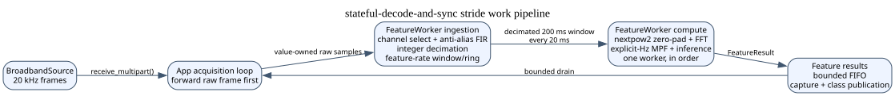

# Stateful Decode and Sync (`stateful-decode-and-sync`)

A Synapse App for the SciFi-2 that, over live consumer taps:

1. **toggles a broadband stream** between the real RHD2132 probe (peripheral
 id 200) and an in-app **synthetic source** ported from the axon-peripherals gateware model;
2. **collects labeled feature windows** into bounded independent collections
   of per-class ring buffers;
3. computes **Kaifosh-2025 multivariate power-frequency (MPF)** features
 (channel-wise STFT → cross-spectral density → band averaging → Hermitian matrix logarithm);
4. **trains and runs a small MLP** classifier (2 hidden layers, dropout,
 softmax + cross-entropy), all on-device.

Node graph:

```
kBroadbandSource(id=1, peripheral_id=200, 20 kHz, 16-bit, 32 ch)
        │  (connection src=1 -> dst=2)
        ▼
kApplication(id=2, name="stateful-decode-and-sync")
        ├─ consumer  control               ControlCommand (versioned v1)
        ├─ consumer  set_source_mode  [mode]            0=SAMPLING 1=SYNTHETIC
        ├─ consumer  set_capture      [label, enable]
        ├─ consumer  fit_mlp          [epochs?]         (trigger)
        ├─ producer  broadband_out    BroadbandFrame    (real forwarded | synthetic)
        └─ producer  class_out        Tensor[num_classes]  softmax
```

In SAMPLING mode the App forwards each upstream `BroadbandFrame` **unchanged** on `broadband_out` (source timestamps are preserved, per repo policy). In SYNTHETIC mode it emits its own deterministic frames with a monotonic sequence number and a derived timestamp. The typed `control` tap and all legacy control shims enqueue bounded requests; the main loop applies them serially before the next source batch is routed. Raw sample batches are transferred through a bounded, thread-safe queue to `FeatureWorker`. Its ingestion thread selects channels, applies the streaming anti-alias FIR, decimates, maintains the feature-rate window, and queues immutable completed windows to a FIFO compute thread, which performs MPF and optional model inference in order. The main loop only drains bounded feature results for capture and SDK publication.

The editable source for the acquisition/compute flow is
[`docs/feature-worker-pipeline.dot`](docs/feature-worker-pipeline.dot).

<!-- graphviz:apps/stateful-decode-and-sync/docs/feature-worker-pipeline.dot -->

<!-- /graphviz:apps/stateful-decode-and-sync/docs/feature-worker-pipeline.dot -->

## Source layout

| File | Role |
| --- | --- |
| `src/mode_switch_app.{hpp,cpp}` | App subclass: typed/legacy taps, serial command application, mode FSM, windowing |
| `src/synthetic_source.{hpp,cpp}` | ported gateware synthetic neural source |
| `src/mpf_features.{hpp,cpp}` | STFT + CSD + band-average + Hermitian matrix-log |
| `src/feature_decimator.hpp` | guarded integer-decimation plan + anti-alias FIR design |
| `src/feature_worker.hpp` | staged ingestion/decimation, windowing, ordered compute, and diagnostics |
| `src/mlp.{hpp,cpp}` | hand-rolled 2-hidden-layer MLP + backprop + SGD |
| `src/fit_worker.hpp` | managed background fit, immutable snapshot, and candidate events |
| `src/collection_store.hpp` | bounded multi-collection store, flushes, and generations |
| `proto/gui_control.proto` | versioned command, result, and state protobuf schema |
| `src/control_protocol.hpp` | v1 payload validation and protobuf serialization helpers |
| `src/control_command_queue.hpp` | bounded FIFO for off-thread tap callbacks and main-loop control |
| `src/control_state.hpp` | atomic target transition and selection rules |
| `src/ring_buffer.hpp` | per-class feature store |
| `config/rhd2132_mode_switch.json` | kBroadbandSource(200) → kApplication graph |
| `client/*.py` | control/monitor clients |

## Installable host client

The GUI/socket client supports CPython 3.13. From the repository root, create
or activate a virtual environment and install the client package:

```bash
py -3.13 -m venv .venv
.venv/Scripts/python -m pip install -e apps/stateful-decode-and-sync/client
```

This installs the `stateful-decode-and-sync-service`,
`stateful-decode-and-sync-gui`, `stateful-decode-and-sync-calibration`, and
`stateful-decode-and-sync-fake-demo` commands. The package depends on
`science-synapse` for real device Taps and PySide6 for the GUI; the fake demo
and hardware-free tests use no SciFi-2.

To verify the install without hardware:

```bash
stateful-decode-and-sync-fake-demo
PYTHONPATH=apps/stateful-decode-and-sync/client \
  .venv/Scripts/python -m unittest discover \
  -s apps/stateful-decode-and-sync/client/tests -v
```

The fake demo exits after a controller/state round trip. To run the real
tools, use `stateful-decode-and-sync-service --device-ip "$DEV" --port 8765`,
`stateful-decode-and-sync-gui --device-ip "$DEV"`, or the calibration command
shown below. The service host defaults to `127.0.0.1`; selecting `--host`
outside loopback is an explicit, unauthenticated operator choice.

The synthetic source is a faithful port of `vendor/axon-peripherals/src/gateware/src/axon_test_source_peripheral.sv` (256-entry sine LFP LUT, 32-sample biphasic spike ROM, per-channel delay LUT, 16-bit spike-trigger LFSR seeded from `synthetic_seed`, 32-bit noise LFSR). It reproduces the gateware's per-sample values and per-channel lags but does not emulate the AXI-stream bus timing.

The MPF matrix logarithm uses a hand-rolled cyclic-Jacobi Hermitian eigensolver (`mpf_features.cpp`), so **no `eigen3`/BLAS dependency is added** to `vcpkg.json`.

When `frequency_bands_hz` is present, its ordered `[low_hz, high_hz]` pairs
select the physical half-open frequency bands used by MPF. The feature worker
chooses the largest integer decimation that preserves an anti-alias transition
band above the highest configured edge and exactly divides both the source-rate
window and stride. Thus the ring still represents 200 ms and advances every
20 ms without clock drift. The temporal ring contains exactly
`round(feature_sample_rate_hz * window_ms / 1000)` real samples; each immutable
compute window is then zero-padded to the next power of two for one radix-2
transform. Padding never lengthens the live ring or its represented time span.
The FIR-center source sequence and timestamp are retained on each decimated
sample. Omitting `frequency_bands_hz` preserves the legacy full-Nyquist split
and disables automatic decimation.

The shipped configuration uses `[0, 62.5)`, `[62.5, 125)`, `[125, 250)`,
`[250, 375)`, `[375, 687.5)`, and `[687.5, 1000)` Hz. With the 20 kHz source,
200 ms window, 20 ms stride, and 1.25 guard ratio, the exact-clock constraints
select decimation by 8: the feature rate is 2.5 kHz, its Nyquist frequency is
1.25 kHz, and the 500-sample temporal window is zero-padded to 512 points for
the FFT.

The dynamically sized transform uses a preplanned radix-2 FFT. MPF accumulates
only one CSD triangle, stops Jacobi sweeps on a scale-relative tolerance, and
reconstructs only the configured matrix-log entries. The eigendecomposition
still uses the complete CSD: retained matrix-log entries depend on every
selected-channel covariance, so truncating the CSD itself would change the MPF
operator. Feature-worker diagnostics report cumulative average and maximum MPF
and inference service times separately (`mpf_*_us`, `inference_*_us`) alongside
the queue/drop counters.

The MLP z-scores each feature dimension using mean/std fit from the captured training set (applied identically at inference). Raw MPF features span orders of magnitude across bands and channel pairs; standardising them keeps SGD well-conditioned so `mlp_lr` need not be hand-tuned to the feature scale. An offline smoke test (`g++`-built, SDK-independent) confirms the synthetic source is deterministic, the reduced feature dimension is correct, and the MLP learns separable synthetic classes end-to-end.

The canonical GUI/control-plane payloads are typed protobuf messages in
`proto/gui_control.proto`. `src/control_protocol.hpp` validates protocol v1
envelopes, command arguments, complete state snapshots, and correlated command
results before serialization or application. The `control` consumer tap now
validates and queues typed commands for serial application in the App main loop.
The legacy `set_source_mode`, `set_capture`, and `fit_mlp` taps remain
compatibility shims through the same queue. State and command-result producer
taps publish complete v1 snapshots and correlated results; snapshots are emitted
at startup, after command application, and periodically at 2 Hz. A running fit
also emits one accepted `FitProgress` result and matching state snapshot per
completed epoch, then one terminal result; malformed or non-finite training data
is reported as a terminal `malformed` error. It trains from a value-owned
collection snapshot, keeps the existing live model available during fitting, and
swaps a complete candidate into inference only after success; a malformed or
failed fit does not replace a prior model.

## Feature dimension

Per window the featurizer emits `B · [C + K(2C − K − 1)]` real values, where `B` is the number of explicit `frequency_bands_hz` entries (or legacy `num_bands`), `C` is the featurized channel count, and `K = min(num_off_diag_bands, C − 1)`. Each frequency band retains all `C` diagonal values plus the first `K` upper off-diagonal matrix bands, with each retained off-diagonal value represented by real and imaginary parts. With the shipped `B = 6`, `C = 8`, and `K = 2`, each window contains **204** features.

> `num_off_diag_bands` is a matrix-offset count, not the number of frequency
> bands: `1` retains `(i,i+1)` and `2` additionally retains `(i,i+2)`.

## Build

Requires Docker (cross-compiles to arm64) and `synapsectl`. From the repo root:

```bash
synapsectl apps build apps/stateful-decode-and-sync
```

The Synapse API protos and the Science `vcpkg` overlay ports/triplets are vendored under `external/sciencecorp/` so the app builds without a submodule fetch. `.gitmodules` records their upstream pins (`synapse-api` `de75a2c`, `vcpkg` `b4defd7`); to refresh them to upstream, `git submodule update --init` against those URLs and re-vendor.

## Deploy, start, monitor

```bash
DEV=192.168.100.157

synapsectl -u $DEV apps deploy apps/stateful-decode-and-sync
synapsectl -u $DEV start apps/stateful-decode-and-sync/config/rhd2132_mode_switch.json

synapsectl -u $DEV taps list
synapsectl -u $DEV stop
```

On Windows run `synapsectl` with `PYTHONUTF8=1` (its check-mark output crashes under cp1252 — see repo `MISTAKES.md`).

## Live control (clients)

```bash
DEV=192.168.100.157

# 1. switch the source live
python client/set_source_mode.py --device-ip $DEV synthetic
python client/set_source_mode.py --device-ip $DEV sampling

# 2. capture labeled windows (repeat per class; toggle source/stimulus between)
python client/set_capture.py --device-ip $DEV --label 0 --on
#   ... let windows accumulate ...
python client/set_capture.py --device-ip $DEV --label 0 --off

# 3. train on everything captured
python client/fit_mlp.py --device-ip $DEV            # uses configured epochs
python client/fit_mlp.py --device-ip $DEV --epochs 200

# 4. watch live classifications
python client/listen_class.py --device-ip $DEV
```

For a bounded, read-only producer check, run the broadband probe in each
source mode and compare its sequence/timestamp and channel metadata:

```bash
python client/broadband_probe.py --device-ip $DEV --duration 5
```

The report includes valid-frame count and observed rate, sequence gaps and
reordering, timestamp regressions and deltas, sample rate, payload channel
count, `channel_ranges`, and malformed-payload count. It never sends a device
command. A producer subscription can miss frames before the subscriber is
ready, so use the probe's sustained count/rate and sequence diagnostics rather
than treating the first sequence number as a zero-based stream origin.

Bench note (2026-08-31): after the IntanRHD2132 re-enumerated and the app was
freshly started against the verified ID 200, the synthetic probe was clean
(7,768 frames/5 s, no sequence or timestamp faults). The real sampling probe
reached the `ELECTRODE:32` path but observed 97,945 missing source sequences in
5 s; the app log also recorded a dropped-frame interval. Treat real sampling
as a throughput investigation until that source-drop behavior is explained.

## GUI and loopback service

The graphical client owns the device Tap connections through a replaceable
transport. The GUI never calls Synapse from the Qt thread; state snapshots are
immutable replacements and all target changes use the atomic `prepare_capture`
command. The controller reports malformed device messages as a state error,
publishes `pipeline.state=disconnected` when a Tap fails, wakes pending
commands instead of waiting for their timeout, and provides bounded reconnect
backoff. Install the host dependencies from `client/requirements.txt`, then
launch the dashboard with:

```bash
python client/run_gui.py --device-ip "$DEV"
```

For external tools, the same controller can expose the versioned loopback
NDJSON service. It binds only to localhost by default:

```bash
python client/run_service.py --device-ip "$DEV" --port 8766
```

The service supports `get_state`, `subscribe_state`, `prepare_capture`,
`select_collection`, `select_label`, `set_capture`, `fit`, and `flush`. Remote
binding is unauthenticated in v1 and must be an explicit operator choice.
Requests are serialized before reaching the controller. State subscribers have
a bounded latest-snapshot queue, so a slow client cannot accumulate stale
state indefinitely; command timeouts and controller disconnects retain
explicit error codes in the NDJSON response.

The controller's hardware-free tests run without a device:

```bash
PYTHONPATH=client python -m unittest discover -s client/tests -v
```

The dependency-light socket client and safe calibration example can be used
without importing the Synapse SDK in the calling tool:

```bash
python client/calibration_prompter.py --host 127.0.0.1 --port 8765 \
  --collection 0 --labels 0 1 2 3 4
```

The prompter first queries a complete state snapshot, then uses one atomic
`prepare_capture(..., enabled=false)` per target. It enables capture only for
the prompted window and disables it in a `finally` cleanup before the next
target is selected. It never connects to device Taps directly.

The dashboard renders whole immutable snapshots: pipeline/source connectivity,
active target and capture state, every reported label count/capacity, and model
phase/epoch/loss/accuracy/duration with a stale indicator. Controller callbacks
are queued for the Qt thread, while device connections and commands run in
worker threads; a fake-state Qt smoke test runs with `QT_QPA_PLATFORM=offscreen`.
Target changes use the single atomic Apply action, all mutating controls are
gated while their request is pending, fit progress does not re-enable them
until its terminal result, and label/collection/all flushes require explicit
confirmation. A zero or unavailable capacity is shown as unknown rather than
as a false percentage.

## Configuration parameters

All parameters have safe defaults. Window/stride are defined in source-clock
milliseconds, then divided exactly onto the selected feature-rate clock.

| Key | Meaning | Default |
| --- | --- | --- |
| `sample_rate_hz` | expected upstream rate | 20000 |
| `num_classes` | ring-buffer categories / MLP outputs | 5 |
| `window_ms` | feature window length (ms) → one MPF vector | 200 |
| `stride_ms` | decoder stride / hop (ms) | 20 |
| `frequency_bands_hz` | ordered, non-overlapping `[low_hz, high_hz]` MPF bands; enables guarded decimation | `[0,62.5), [62.5,125), [125,250), [250,375), [375,687.5), [687.5,1000)` |
| `decimation_guard_ratio` | required post-decimation Nyquist / highest configured edge | 1.25 |
| `num_bands` | legacy even full-Nyquist split used only when explicit Hz bands are absent | 8 |
| `num_off_diag_bands` | upper matrix offsets retained in addition to the diagonal | 2 |
| `channel_subset` | channel ids to featurize (empty ⇒ all) | 8-ch subset (config) |
| `ring_capacity` | max feature windows stored per class | 2000 |
| `mlp_hidden` | hidden units per layer | 64 |
| `mlp_dropout` | dropout prob between layers | 0.2 |
| `mlp_lr` | SGD learning rate | 0.01 |
| `mlp_epochs` | training epochs per fit | 100 |
| `synthetic_seed` | spike-LFSR / MLP-init seed | 44257 (0xACE1) |

## Verification plan

Staged on the bench (see repo `PLAN.md`): (0) build + republish frames, (1) real↔synthetic toggle, (2) labeled ring buffer counts, (3) MPF feature dim + numerical sanity vs a NumPy recomputation, (4) MLP learns separable synthetic classes end-to-end. Each stage builds/deploys/verifies before the next.
