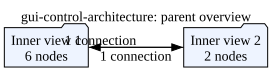

# Broadband mode-switch control protocol

Status: design contract for the GUI/control-plane work (protocol version 1).

This document freezes the state and concurrency semantics for the device
control/status taps and Python clients. The C++ App now consumes the typed
`control` command tap and applies commands serially at the main-loop boundary;
`set_source_mode`, `set_capture`, and `fit_mlp` remain `ListValue`
compatibility shims. `broadband_out` still produces `BroadbandFrame` and
`class_out` still produces `Tensor`. The versioned interface below is the
canonical interface for new clients.

## Terms and ownership

- A **label buffer** is one fixed-capacity FIFO ring of feature vectors for one
 class label. This is the current `RingBuffer` class's per-label deque (`src/ring_buffer.hpp`). Appending at capacity evicts that label's oldest vector only.
- A **collection** is a bounded bank of label buffers. Collections are
 independent: appending to or flushing one collection never changes another.
- The device owns acquisition, collection mutation, fitting, model inference,
 and the Synapse taps. A headless Python controller owns all device Tap connections. The PySide6 GUI and loopback socket clients consume controller state and submit commands through it; neither connects to device taps directly.
- `active_collection`, `active_label`, and `capture_enabled` are separate
 state fields. A selected target is not implicitly enabled, and disabling capture does not change the selected target.

The active target is the only target used for capture. Classification uses the single live model and does not depend on the current capture target.

## Bounded storage contract

The device must reject configuration or commands that exceed these v1 bounds:

| Quantity | Valid range / limit | Shipped value |
| --- | --- | --- |
| collection count | 1..8 | 1 |
| labels per collection | 1..32 | `num_classes` (5) |
| vectors per label | 1..10,000 | `ring_capacity` (2,000) |
| feature dimensions | 1..8,192 | featurizer output (256) |
| raw feature storage | checked total <= 64 MiB | 5 x 2,000 x 256 x 4 bytes |

The raw-storage check is `collections * labels * capacity * feature_dim * sizeof(float)` with checked multiplication; metadata and temporary fit snapshots require additional bounded allocations. A request with an invalid dimension or an overflow is rejected before mutating state. Existing app configuration fields map to one collection until collection configuration is implemented. Changing dimensions or collection layout is startup configuration and clears in-memory data; it is not a live resize operation.

## Device state model

The versioned state snapshot has this logical shape. T-5 implements the canonical device representation as the typed local protobuf schema in [`../proto/gui_control.proto`](../proto/gui_control.proto), with validation and serialization helpers in [`../src/control_protocol.hpp`](../src/control_protocol.hpp). The later Python/socket layers may represent 64-bit counters as decimal JSON strings at their boundary; the device protobuf uses native `uint64` fields.

```json
{
  "type": "state",
  "protocol_version": 1,
  "state_version": 42,
  "timestamp_ns": "1234567890",
  "pipeline": {"state": "ready", "source_mode": "sampling"},
  "active": {"collection_id": 0, "label": 2, "capture_enabled": false},
  "collections": [
    {
      "collection_id": 0,
      "data_generation": "17",
      "labels": [
        {"label": 0, "count": 100, "capacity": 2000},
        {"label": 1, "count": 0, "capacity": 2000}
      ]
    }
  ],
  "model": {
    "phase": "succeeded",
    "ready": true,
    "source_collection_id": 0,
    "source_generation": "12",
    "stale": true,
    "epoch": 100,
    "total_epochs": 100,
    "loss": 0.12,
    "accuracy": 0.98,
    "duration_ms": 4312
  },
  "last_error": null
}
```

`state_version` increments for every published replacement snapshot. The controller treats snapshots as immutable replacements, not patches. A state snapshot is published immediately after a state-changing command and periodically at approximately 2--5 Hz so a late subscriber can recover.

Each collection has a monotonically increasing `data_generation`, incremented after every successful feature append and after every successful flush that changes that collection. A generation is never silently reset during the process lifetime. The snapshot reports counts and capacities; the host may derive fullness as `count / capacity` and must render an unknown/disabled fullness state when capacity is zero or unavailable.

Fitting takes an immutable snapshot of the requested active collection and its generation under the data lock, then trains a candidate model without holding that lock or the live-model lock. On successful completion, the candidate is swapped into the one live inference model. The model records `source_collection_id` and `source_generation`. It is `stale` when the source collection's current generation differs from the recorded generation. New samples arriving during a fit therefore never alter the candidate silently: the fit can succeed and immediately be marked stale. A failed fit never replaces a previously live model.

The model phase is one of `idle`, `queued`, `running`, `succeeded`, `failed`, or `cancelled` (cancellation is reserved for a later command if implemented). Progress fields are meaningful in `running` and terminal phases. A fit while another fit is queued or running is rejected as `busy` in v1.

While a fit is running, each completed MLP epoch emits a non-terminal
`command_result` with `status: accepted` and a `progress` object containing the
one-based epoch, total epochs, mean loss, and training accuracy. The complete
state snapshot immediately before that result carries the same metrics and its
`state_version` is copied into the result. The terminal `succeeded` result also
carries the final progress metric. Progress is only valid on `fit` results.

## Commands

All canonical commands carry `protocol_version: 1`, a non-empty unique `request_id`, and a `command`. Arguments are validated before any state is changed. Mutating commands are applied serially on the device main-loop boundary, before the next feature window is routed.

| Command | Arguments | Semantics |
| --- | --- | --- |
| `get_state` | none | Return the latest complete snapshot. |
| `subscribe_state` | `enabled` | Socket-level subscription; device state publication remains periodic. |
| `prepare_capture` | `collection_id`, `label`, `enabled` | Atomically validate/select the collection and label and set capture. |
| `select_collection` | `collection_id` | Select while capture is disabled; does not change label or capture. |
| `select_label` | `label` | Select while capture is disabled; does not change collection or capture. |
| `set_capture` | `enabled` | Toggle capture for the already selected target. |
| `fit` | optional `epochs` | Snapshot and fit the active collection. |
| `flush` | `scope`, optional target | Clear `label`, `collection`, or `all`; target defaults to active for `label`/`collection`. |

`prepare_capture` is the safe targeting primitive. A successful command changes the three active fields as one transition, so no feature window can be routed to a partially updated target. Individual selection commands reject with `capture_enabled` while capture is enabled; clients should disable first or use `prepare_capture`. A `set_capture` command does not implicitly select a label or collection.

Flush scopes are precise:

- `label` clears one label buffer in one collection;
- `collection` clears every label buffer in one collection; and
- `all` clears every collection.

The main loop serializes flush, capture, and selection operations with feature routing. If a feature window is processed before a flush in that order it is included and the generation reflects it; if processed after, it is not. There is no partially flushed or intermediate-target state exposed to inference or capture. A successful flush increments the affected collection generation; flushing an already empty scope is successful but does not increment it.

`fit` rejects when the pipeline is not ready, the active collection has no vectors, epochs are outside the configured safe range, or another fit is active. It captures the collection generation before training. New appends are allowed during training and are reported through `model.stale` as described above.

## Results, errors, and races

The device publishes a correlated result envelope:

```json
{
  "type": "result",
  "protocol_version": 1,
  "request_id": "client-7/31",
  "command": "prepare_capture",
  "status": "succeeded",
  "state_version": 43,
  "error": null
}
```

`status` is `succeeded`, `accepted`, or `failed`. Ordinary commands produce one terminal result. A fit produces `accepted` when queued, zero or more non-terminal accepted progress results, and exactly one terminal result with the same request ID when it finishes or fails. Failures use a stable `error.code`, human-readable `error.message`, optional `error.field`, and `retryable` flag. Malformed or non-finite training data terminates the fit with `error.code: malformed`. The initial v1 codes are `malformed`, `unsupported_version`, `unknown_command`, `invalid_argument`, `out_of_range`, `pipeline_not_ready`, `capture_enabled`, `busy`, `empty_collection`, `duplicate_request_id`, `timeout`, `transport_disconnected`, and `internal`.

Invalid commands and rejected commands do not mutate active state, buffers, generations, or the live model. The controller serializes outbound mutations and supplies timeouts; a device-side application of a command is not undone by a client timeout. After reconnect, the client must query/replace state and must not replay a timed-out mutation unless its request ID is known not to have been applied.

Request IDs are unique across the controller's live session. A duplicate ID for an in-flight request returns `duplicate_request_id`; a duplicate ID for a completed request returns the cached terminal result without reapplying the command. The cache is bounded and may expire only after the session is reset.

## Tap mapping and compatibility

The device taps are:

| Tap | Direction | Payload |
| --- | --- | --- |
| `control` | consumer | Versioned command envelope; validated and queued for serial main-loop application. |
| `state` | producer | Complete versioned state snapshots. |
| `command_result` | producer | Correlated result/progress envelopes. |
| `broadband_out` | producer | Existing `BroadbandFrame`; unchanged source timestamps in sampling mode. |
| `class_out` | producer | Existing little-endian float `Tensor[num_classes]`. |

The controller implementation belongs under `client/` and is the only layer that constructs `synapse.client.taps.Tap` connections. The existing scripts [`set_source_mode.py`](../client/set_source_mode.py), [`set_capture.py`](../client/set_capture.py), [`fit_mlp.py`](../client/fit_mlp.py), and [`listen_class.py`](../client/listen_class.py) document the legacy wire types and remain usable during migration. T-7 implements the `state` and `command_result` producer taps described above. The device emits a complete baseline snapshot before acquisition, a snapshot immediately before each correlated command result, and periodic snapshots at 2 Hz. T-8 added one accepted progress result and matching state snapshot per completed epoch; T-9 keeps that publication sequence while moving training to a managed worker with an immutable collection snapshot and successful candidate-model swap.

Legacy behavior is deliberately limited:

- `set_source_mode`: `ListValue [mode]`, where 0 is sampling and 1 is
 synthetic; it maps to the new source-mode field but has no correlated ack.
- `set_capture`: `ListValue [label, enable]`; it targets collection 0 and is
 adapted to `prepare_capture(0, label, enable)` by the compatibility layer.
- `fit_mlp`: `ListValue [epochs?]`; it maps to `fit` and exposes only existing
 logs until the new result/status taps are available.
- `broadband_out` and `class_out` retain their current protobuf message types
 and timestamp/endianness semantics.

New clients must not mix legacy direct taps with canonical commands in one control session. There is no live migration of the current one-bank buffer into a newly configured multi-collection bank; restart/configuration is the compatibility boundary. Peripheral identity is deployment configuration, not a protocol field: bench workflows must query the running device with `synapsectl ... info` and use the reported identity rather than assuming one.

## Loopback NDJSON service

The Python controller exposes an optional asyncio TCP service for the GUI and external tools. It binds to `127.0.0.1` by default; binding another interface is opt-in and unauthenticated in v1.

- Transport is UTF-8 TCP with one JSON object per line, terminated by `LF`.
- Reads may be fragmented or coalesced. A server buffers until `LF` and
 enforces a 64 KiB maximum line; an oversized line is rejected and the connection is closed after its error response when possible.
- Every request includes `protocol_version`, `request_id`, and `command`.
 `request_id` is unique per client session and is echoed in results.
- Supported socket commands are `get_state`, `subscribe_state`,
 `prepare_capture`, `select_collection`, `select_label`, `set_capture`, `fit`, and `flush`. The socket service maps them to the canonical device commands; it never bypasses the controller with direct Tap calls.
- Bad JSON, missing fields, wrong types, unsupported versions, and invalid
 arguments return a `failed` result with a stable error code. The server continues reading after a recoverable bad request.
- State events are complete replacement snapshots. A slow subscriber may have
 intermediate snapshots coalesced, but terminal command results are never coalesced. A bounded per-client queue disconnects a client that cannot accept its terminal results.
- While a socket `fit` request is running, the service forwards each accepted
  progress result for that request, followed by the terminal response. Progress
  is correlated to the external request id and is never used as a state patch.
- Mutating requests from multiple clients share the controller's FIFO command
 serialization and therefore have observable result/state order. Disconnect cancels delivery to that client but does not cancel an already applied device command.

The socket response/event shapes are the same `result` and `state` envelopes shown above. This keeps the GUI, loopback clients, and fake-device tests on one contract.

## Architecture/data flow

The bounded design and the ownership boundary are shown in [`gui-control-architecture.svg`](gui-control-architecture.svg); the editable source is [`gui-control-architecture.dot`](gui-control-architecture.dot).



<!-- graphviz:apps/stateful-decode-and-sync/docs/gui-control-architecture.dot -->

<!-- /graphviz:apps/stateful-decode-and-sync/docs/gui-control-architecture.dot -->
