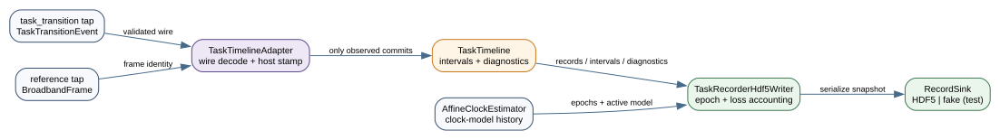

# Host task-recorder timeline

<!-- graphviz:apps/stateful-decode-and-sync/docs/task-recorder-timeline.dot -->

<!-- /graphviz:apps/stateful-decode-and-sync/docs/task-recorder-timeline.dot -->

`src/task_timeline.{hpp,cpp}` is the hardware-free host recorder boundary for T-32/H-22. It receives an immutable, value-owned copy of every committed `TaskTransitionEvent`; snapshots and accepted commands are deliberately not inputs. Each raw record retains the task-definition identity, app/run/event sequences, effective `BroadbandFrame` identity, proposal metadata, and the separate host receive timestamp.

Observed start and transition commits form half-open state intervals. An abort or reset closes the active interval. An event-sequence gap, duplicated or reordered event, source/frame regression, or explicit reference discontinuity is retained as a diagnostic and marks the affected timeline interval incomplete. The recorder never fills such a hole with a guessed transition.

`TaskTimeline::label` consumes the auxiliary sample's persisted affine-clock mapping interval. It emits a state label only when the entire uncertainty interval lies inside one complete task interval. Crossing either boundary is `ambiguous`; an unbounded clock, missing active state, or incomplete history also remains an explicit non-label.

`src/task_timeline_adapter.{hpp,cpp}` connects the two authoritative wire streams to this value boundary. It reuses the producer-side `validate_task_transition_event` contract so the recorder refuses exactly what the App refuses to publish, translates the wire `TaskEventKind`/`TaskTriggerKind` enums into the value-layer kind and a stable canonical trigger string, and stamps a host receive time on receipt (the receipt time is not a wire field). The reference `BroadbandFrame` tap is observed as a small `ReferenceFrameObservation` value so the adapter and its test build without the closed SDK headers; a reference-stream sequence gap or regression calls `mark_reference_discontinuity`, marking the active interval incomplete without inventing a transition. HDF5 serialization will persist these value records without changing their semantics.
