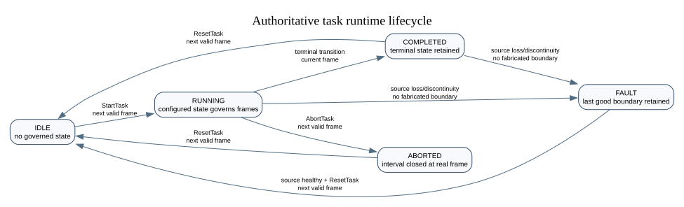

# Authoritative task-state contract (v1)

Status: normative implementation contract for T-28 through T-34.

This document defines the configured behavioral task state owned by the
`stateful-decode-and-sync` App. It is separate from pipeline readiness, ML
feature capture, model fitting, and raw recording. A client can propose an
event or a configured transition, but it cannot assign the current state.

The authoritative boundary of every committed task change is one observed
reference `BroadbandFrame`: the event names the first frame governed by the
new state. A multipart receive is only a transport batch; every frame in it is
an independent possible boundary.

The ownership and recording path is shown in
[`task-state-authority-plan.svg`](task-state-authority-plan.svg). The runtime
lifecycle is shown in [`task-runtime-lifecycle.svg`](task-runtime-lifecycle.svg).

<!-- graphviz:apps/stateful-decode-and-sync/docs/task-runtime-lifecycle.dot -->

<!-- /graphviz:apps/stateful-decode-and-sync/docs/task-runtime-lifecycle.dot -->

## Configuration shape and bounds

`task_definition` is an optional nested object in
`ApplicationNodeConfig.parameters`. If it is absent, task authority is
disabled and the existing acquisition, capture, fit, and recording behavior
remains available. If it is present, any contract violation fails App setup;
the App must not silently disable or repair the definition.

All integer-valued JSON numbers must be finite, integral, non-negative, and no
greater than `2^53 - 1`, because `google.protobuf.Value` represents them as
binary64 numbers. The tighter field limits below also apply.

| Item | v1 bound |
| --- | --- |
| Canonical definition | at most 64 KiB |
| Definition id or any name | 1-64 ASCII characters matching `[A-Za-z][A-Za-z0-9_.-]*` |
| Revision | 1 to `2^53 - 1` |
| States | 1-64 |
| Transitions | 0-256 total, at most 32 outgoing from one state |
| State or transition id | integer 1-65535; zero is reserved for `NO_STATE` in runtime events |
| Priority | integer 0-255; unique among transitions leaving the same state; larger wins |
| External event name | same syntax and bound as other names |
| Timeout | 1 ns through 86,400,000,000,000 ns (24 hours) |
| Decoder label | integer 0 through configured `num_classes - 1` |
| Decoder probability threshold | integer 1-1,000,000 parts per million |
| Decoder dwell | 1-10,000 consecutive decoder results |
| Source-loss detection | 1-60,000 ms |
| Staged command timeout | 1-60,000 ms; at most 64 staged task commands |

The v1 object contains exactly these fields; unknown fields inside it are a
setup error:

```json
{
  "task_definition": {
    "schema_version": 1,
    "definition_id": "reach_grasp",
    "revision": 3,
    "initial_state_id": 1,
    "states": [
      {"id": 1, "name": "waiting", "terminal": false},
      {"id": 2, "name": "active", "terminal": false},
      {"id": 3, "name": "complete", "terminal": true}
    ],
    "transitions": [
      {
        "id": 10,
        "name": "begin",
        "from_state_id": 1,
        "to_state_id": 2,
        "priority": 100,
        "trigger": {"kind": "external_event", "event_name": "go"}
      },
      {
        "id": 11,
        "name": "retry",
        "from_state_id": 2,
        "to_state_id": 1,
        "priority": 50,
        "trigger": {"kind": "source_timeout", "after_ns": 5000000000}
      },
      {
        "id": 12,
        "name": "decoded_success",
        "from_state_id": 2,
        "to_state_id": 3,
        "priority": 100,
        "trigger": {
          "kind": "decoder_predicate",
          "label": 1,
          "probability_threshold_ppm": 800000,
          "dwell_results": 3
        }
      }
    ],
    "source_policy": {
      "loss_action": "fault",
      "loss_timeout_ms": 1000,
      "sequence_gap_action": "continue",
      "staged_command_timeout_ms": 5000
    }
  }
}
```

The state and transition array order has no meaning. IDs and names are unique
within their respective collection. An ID is stable across revisions of one
`definition_id`: authors must not reuse it for a different semantic state or
transition. The initial state must exist. Every state must be reachable from
the initial state when trigger conditions are ignored. A terminal state has no
outgoing transitions; every non-terminal state has at least one. Cycles and
self-loops are valid, and a definition is not required to contain a terminal
state or a path to one.

Every transition references existing states and has exactly one trigger:

- `external_event` requires only `event_name`. Two transitions leaving the
  same state cannot use the same external event name.
- `source_timeout` requires only `after_ns`. Its deadline is the effective
  reference timestamp at state entry plus `after_ns`.
- `decoder_predicate` requires only `label`,
  `probability_threshold_ppm`, and `dwell_results`. The label must be valid for
  the configured decoder.

Trigger-specific fields on another trigger kind are errors. Names, ids,
references, reachability, priorities, timer arithmetic, decoder fields, and
all bounds are validated before acquisition starts.

`source_policy.loss_action` is `hold` or `fault`. While no reference frame is
available, neither mode advances source-time timers or commits a change.
`fault` enters the operational `FAULT` lifecycle after `loss_timeout_ms` of
App steady-clock time without a frame; `hold` keeps the last committed task
state. A staged client command can still expire by App steady-clock time in
either mode. `sequence_gap_action` is `continue` or `fault`. A strictly
increasing sequence gap can therefore be recorded and continued or can fault
by policy. A repeated/decreasing sequence or a non-increasing source timestamp
always faults task authority because the next authoritative boundary would be
ambiguous.

## Canonical task profiles that drive later work

The generic v1 engine must remain independent of any one experiment, but two
canonical profiles define required extension points for the product. A profile
compiler will produce a bounded `TaskDefinition` plus typed profile data. The
profile data, generated trial order, and any random seed are part of the
normalized definition/config hash; they cannot live only in a GUI or an
unrecorded host script. Committed events and status must carry enough profile
context (for example trial and step index) for a behavior client and recorder
to identify the exact instruction in force.

The trigger source vocabulary has one consistent interpretation in both
profiles:

- `auto` compiles to a source-time transition (or a future explicit automatic
  next-frame trigger), never a host wall-clock state assignment;
- `socket` compiles to a named `external_event` proposed through the control
  path;
- `decode` compiles to an on-device `decoder_predicate` with its configured
  label, threshold, and dwell.

Changing the configured source changes the definition hash. A behavior client
still reacts only to the committed event, not to its local socket send, decoder
observation, or `RESULT_ACCEPTED`.

### One-dimensional instructed path

The experimenter supplies an ordered, bounded but otherwise arbitrary list of
one-dimensional target instructions and a coordinate/unit description. The
profile owns an authoritative step index; it must not require one hand-written
FSM state per path element or impose a built-in target pattern. Each committed
advance identifies the step index and target value that begins at that
reference frame.

The profile configures `advance_mode` as exactly `auto`, `socket`, or `decode`.
Automatic advance also requires a source-time presentation duration. Socket
advance names the external event. Decoder advance names the label, probability
threshold, and dwell. Completion after the final element is a committed
terminal transition, and reset/start create a new run without silently reusing
an old step index.

The profile schema still needs an explicit maximum path length, signed fixed-
point coordinate representation, units, optional per-step duration/metadata,
and event context fields before implementation. These are profile-layer work;
the T-28 engine must not smuggle them into state names or unbounded JSON.

### Two-dimensional center-out

The canonical phase order is center acquisition, center hold,
peripheral-target presentation, GO, and peripheral completion. The center hold
duration is source-time based. The peripheral target becomes visible only
after the hold requirement commits. The GO cue is the committed boundary at
which the center target disappears; target rendering must use that event rather
than local command acceptance.

The experimenter configures target geometry/order, hold duration, any preview
delay between peripheral appearance and GO, and a completion mode:

- `hold`: entering the peripheral target starts a source-time dwell; leaving
  it cancels the dwell and returns to acquisition;
- `click`: completion requires a click whose source is `socket` or `decode`;
- `drag`: the subject engages the center target, retains the configured drag
  condition while moving, and completes at the outer target according to an
  explicit release/acquire rule.

Center/target entry, exit, engagement, release, and socket click are named
external proposals whose legal ordering is validated by the on-device engine.
A decoded click is an internal decoder predicate, not a direct state write.
If geometry is evaluated by the host behavior process, the definition records
that trust boundary and the host proposes facts; a later on-device geometry
evaluator may replace it without changing the state-authority rule.

Profile data must include exact center/peripheral positions and sizes,
coordinate system and units, target-selection order or deterministic seed,
visibility for each committed phase, click/drag source and rules, timeouts, and
failure/retry behavior. The recorder persists that data with every run. The
generic schema above intentionally does not invent these profile fields; they
must be specified as a typed, bounded, canonical extension before either
profile is claimed as implemented.

## Normalized definition hash

The App computes, rather than accepts, `definition_hash`. It is
`sha256:<64 lowercase hex digits>` over canonical UTF-8 JSON for the validated
v1 fields:

1. Object keys are emitted in lexicographic byte order with no insignificant
   whitespace.
2. States and transitions are sorted by numeric id.
3. Integers use unsigned base-10 form with no leading zeros; booleans use
   `true` or `false`; strings use JSON escaping.
4. Only the fields defined above are present. There is no hash field to omit,
   no floating-point representation, and no implicit default.

Equivalent definitions therefore hash identically regardless of input object
key order or state/transition array order. Changing a source policy, trigger,
name, id, revision, or any other defined value changes the hash.

## Runtime identity and lifecycle

`app_session_id` is a newly generated 128-bit lowercase hexadecimal value for
each successful App setup. Counters can restart only when this identity
changes.

`run_sequence` is an unsigned 64-bit counter scoped to the App session and is
incremented when `StartTask` commits. `event_sequence` is session-scoped,
allocated at each boundary commit, and increments by exactly one. Ordinarily
published events are therefore contiguous; if event publication fails, the
next successfully published event exposes the reserved sequence as a gap.
`transition_sequence` is run-scoped: the start boundary is 1 and every later
boundary event associated with that run increments it by one. Clients compare
the tuple `(app_session_id, run_sequence, transition_sequence)`, never a
counter in isolation.

The lifecycle is:

- `IDLE`: a valid definition is loaded, but no run owns incoming frames.
- `RUNNING`: frames are governed by the current configured state.
- `COMPLETED`: a configured transition entered a terminal state. That terminal
  state continues to govern frames until reset.
- `ABORTED`: an abort boundary ended the active state interval.
- `FAULT`: task authority cannot safely assign another frame boundary. The
  last committed state and boundary remain diagnostic facts, not permission to
  label later frames.

Lifecycle commands obey the same reference-boundary rule:

- `StartTask` is valid only in `IDLE`. At the next valid reference frame it
  increments `run_sequence`, sets `transition_sequence` to 1, changes
  `NO_STATE -> initial_state_id`, and enters `RUNNING` (or `COMPLETED` when a
  deliberately terminal initial state defines a zero-step task).
- `AbortTask` is valid only in `RUNNING`. At the next valid frame it changes
  `current_state_id -> NO_STATE` and enters `ABORTED`.
- `ResetTask` is valid only in `COMPLETED`, `ABORTED`, or `FAULT`, and only
  after the reference source is healthy. At the next valid frame it changes
  the retained state (or `NO_STATE`) to `NO_STATE` and enters `IDLE`. It does
  not rewind session, run, or event counters.

Entering a configured terminal state and entering `COMPLETED` are one atomic
commit. A source-loss timeout can enter `FAULT` without a frame, but it must
not fabricate a `TaskTransitionEvent`, sequence number, or source timestamp.
`TaskStatus` reports the fault and the last good boundary. After source health
returns, reset obtains a real boundary before returning to `IDLE`.

## Proposals, preconditions, and deterministic selection

There is no `SetState` command. The task commands are `StartTask`,
`ProposeTaskEvent`, `ProposeTaskTransition`, `AbortTask`, and `ResetTask`.
Proposing a transition id is not assignment: it is legal only when that
transition leaves the committed current state and has an `external_event`
trigger. Proposing a named event lets the engine select a matching outgoing
transition.

Every mutating task command carries the client's last observed
`expected_app_session_id`, `expected_run_sequence`, and
`expected_transition_sequence`. A proposal while a state is active also
carries `expected_state_id`. Missing or stale preconditions fail without
staging. After reconnect, clients obtain a replacement snapshot; they do not
replay a stale mutation.

An otherwise valid external command receives correlated `RESULT_ACCEPTED`
when the main thread stages it. Acceptance is not a state change and behavior
clients must not react to it. The same request receives exactly one terminal
result:

- `RESULT_SUCCEEDED` only after its boundary event has been published;
- `RESULT_FAILED` if it is rejected, expires before a frame, loses a conflict,
  becomes stale, or task authority faults.

At each valid reference frame the engine revalidates all ready candidates and
commits at most one. A lifecycle abort takes precedence over configured
transitions. Configured candidates are ordered by descending transition
priority, then ascending transition id. Multiple proposals for the same
transition are ordered by their main-thread receipt sequence. The winning
candidate commits; losing external requests receive a terminal conflict or
stale-precondition failure. They are never silently carried into a new state.

Source-time timers are evaluated on every frame and become ready when
`frame.timestamp_ns >= deadline`. The first such observed frame is the commit
boundary. A large timestamp step may make several timers ready, but the normal
priority rule still permits only one commit on that frame. State entry resets
all outgoing timer deadlines and decoder dwell counters; no transition chain
can commit twice on one frame.

A decoder predicate counts consecutive qualifying results produced while its
source state remains committed. A non-qualifying result resets its count. Once
the dwell is met, the decoder stages a proposal, but it cannot commit on a
frame already routed before that decoder result existed. Its earliest boundary
is the next valid frame observed by the main loop. Gaps in numeric source
sequence do not change the meaning of "next observed frame."

Control proposals are drained before acquisition. `read_frames(ReadBatch)`
must then invoke the engine once for each `batch.frames` element in wire order.
A transition on frame N can therefore govern later frame N+1 in the same
multipart receive, and another eligible transition may commit there. Calling
the engine once per multipart batch violates this contract.

## Authoritative event and status

Every boundary commit publishes one immutable `TaskTransitionEvent` containing
at least:

- protocol version, definition id, revision, and normalized hash;
- App session id, run sequence, session event sequence, and run transition
  sequence;
- event kind (`start`, `transition`, `abort`, or `reset`), configured
  transition id when applicable, previous state id, and current state id;
- trigger kind and trigger source (external event name, timeout transition,
  decoder label, or lifecycle command);
- correlated request id for an external winner and the proposal main-thread
  receipt sequence/time;
- exact reference source id, `BroadbandFrame.sequence_number`, and
  `BroadbandFrame.timestamp_ns` of the first frame governed by the result.

`NO_STATE` is encoded as id zero only in runtime status/events; it can never
appear in a definition. Proposal receipt time uses the App steady clock and is
provenance, not the effective boundary. Cross-tap arrival order is not a clock:
consumers correlate by session, sequences, source id, and the effective frame
identity.

The App logically commits, publishes the transition event, publishes the
replacement `StateSnapshot`, and only then publishes a correlated successful
result. A publishing failure must not be reported as success; task authority
enters `FAULT`, retains the reserved event sequence, and any resulting
discontinuity makes the downstream timeline explicitly incomplete.

`StateSnapshot` remains a complete replacement for operational state and is
extended additively with `TaskStatus`. `TaskStatus` reports whether a
definition is configured, definition identity/hash, lifecycle, App session,
the three counters, current and pending state/transition information, latest
effective reference boundary, source health, and a fault reason. The separate
`task_transition` producer tap is the loss-detectable event history; snapshots
must not be used to reconstruct transitions that were not received.

## Recording and aligned auxiliary samples

The neural `BroadbandFrame` is the reference domain. The host fusion/recorder
stores the exact task definition and hash, raw transition events, command
metadata, App/run identity, event sequences, reference frame identity, and host
receipt timestamps. Consecutive events define half-open task intervals
`[effective_i, effective_(i+1))`; start opens an interval, and abort/reset to
`NO_STATE` closes one.

Auxiliary sources retain their raw source and host timestamps. Their samples
are mapped through the persisted affine clock model and uncertainty. If a
sample interval `[t_hat - epsilon, t_hat + epsilon]` crosses a task boundary,
its task label is ambiguous; the recorder must not force it into either state.
An event-sequence gap or source discontinuity makes the affected task timeline
incomplete rather than inferred.

Raw recording control and ML feature capture remain distinct from task state.
A host recording policy may explicitly react to committed task events, but the
App does not implicitly start/stop recording or capture when a task state
changes. The supported runtime split remains: the SciFi-2 App owns neural
reference/task authority, while host adapters, clock fitting, fusion, and HDF5
own independent wireless sources unless the separate topology gate proves a
supported alternative.

## Required setup failures

If `task_definition` is present, setup fails on any wrong JSON value kind,
unknown or missing field, non-integral number, bound violation, invalid name,
duplicate id/name, duplicate outgoing priority, invalid reference, unreachable
state, illegal terminal/non-terminal topology, wrong trigger fields, duplicate
external event from one state, invalid timer/decoder/source policy, arithmetic
overflow, or canonicalization/hash failure. Legitimate cycles and self-loops
are not failures.

Runtime rejection or fault is never rewritten into a setup failure, and setup
validation never mutates acquisition, capture, model, or recording state.
