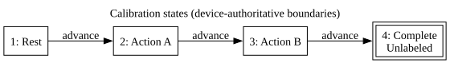
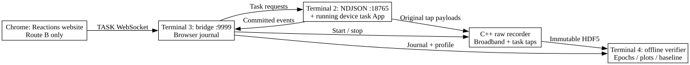

# Record and verify a calibration task

## Choose one route

**Current blocker from the operator's latest `synapsectl info`:** the overall device reports Running, but Application `stateful-decode-and-sync` reports **Running: False**. Resolve Step 2 before starting another instructor. The shown July 24–25 log lines are historical output, not a current App-start failure diagnosis. Connecting Chrome does not start this device App.

**Route A: terminal instructor** is the next recommended smoke test. It presents rest/action A/action B instructions in Terminal 4. **Chrome and the task website are not involved at any point in Route A.**

**Route B: Reactions in Chrome** uses the website as the instructor. Chrome must connect to the WebSocket bridge and explicitly start recording and task epochs. The website integration steps below are required; merely opening the existing site or clicking its old gesture-calibration flow does not guarantee device labels.

Use one route per recording. Do not run the terminal instructor concurrently with the website controller. GPIO 0 troubleshooting is deferred to Science and is not a prerequisite for these task-event tests. Physical synchronization acceptance remains open.

| Location | Route A | Route B | Keep running until |
| --- | --- | --- | --- |
| Terminal 1, WSL | Setup and device configuration | Same | Configuration command returns |
| Terminal 2, WSL | NDJSON control service, port **18765** | Same | Recording and task finish |
| Terminal 3, WSL | C++ raw recorder | WebSocket bridge, port **9999**, owns C++ recorder | Explicit recording stop |
| Terminal 4, WSL | Terminal instructor, then offline analysis | Offline analysis after Chrome stops recording | Command returns |
| Chrome | **Not used** | Website connects after Terminal 3 is ready; runs gestures | Stop acknowledgment received |

All numbered terminals are in the **same WSL distribution** with the project's 64-bit CPython 3.13 environment activated. Run these setup lines in **each new terminal** (variables are not shared between shells):

```bash
cd /mnt/c/MyRepos/C/ScienceXYZ
export DEV=192.168.100.157
export SETUP=data/calibration-task-v2
```

Use the current device address if different. These commands assume `python` is from your working WSL environment. Do not switch to native Windows Python midway through this sequence. Chrome may run on Windows for Route B if WSL localhost forwarding works. The waveform GUI is optional monitoring; it supplies neither of the two socket services.

## Common steps: complete these before either route

### Step 1 ? Terminal 1: finish setup once

Your `calibration-task-v2` preparation already succeeded with hash `sha256:5f67d6b0807d5a2537e1e0fea26a3bbd8d45fa5978b7fd8c59b1bf2b224e9f7f`. **Skip preparation if its three JSON files are present.** Check them:

```bash
ls "$SETUP/device-config.json" "$SETUP/task-profile.json" "$SETUP/provenance.json"
```

For a new setup only, install dependencies and generate a **new** output directory (change `SETUP` in all terminals if choosing a different setup):

```bash
python -m pip install -e 'apps/stateful-decode-and-sync/client[test,waveform,recording]'
python apps/stateful-decode-and-sync/client/calibration_task.py prepare \
  --base-config config/rhd2132.json \
  --provenance config/calibration-provenance.template.json \
  --output-dir "$SETUP"
```

Expected: `Prepared ...; definition sha256:...`. Do not pre-create the output directory. Existing directories and journals are protected against overwrite; ignored files from older sessions are not guaranteed to exist. The host C++ recorder must already be built using the [recorder build guide](calibration-recording-mvp.md#host-recorder-build-and-use).

Before recording, edit `task-profile.json` to name the actual gestures in `instructions` and `state_to_label`. Keep state 1 as rest, choose distinct action A/B labels, and keep state 4's label null. Leave `definition` and its hash unchanged. Populate `provenance.json` with current device/config evidence and wiring; leave genuinely unknown fields null. After editing the profile, synchronize its copy in provenance in Terminal 1:

```bash
python - <<'PY'
import json, os
from pathlib import Path
setup = Path(os.environ['SETUP'])
profile = json.loads((setup / 'task-profile.json').read_text())
path = setup / 'provenance.json'
metadata = json.loads(path.read_text())
metadata['task_profile'] = profile
path.write_text(json.dumps(metadata, indent=2) + '\n')
PY
```

This edits setup metadata before recording, never an existing raw file. Prepared configuration preserves the base config's peripheral IDs; verify them against current operator evidence rather than assuming historical ID 200 remains valid.

### Step 2 ? Terminal 1: apply the task-enabled device configuration

Finish/stop any old host recording and stop its old service/bridge before replacing its device configuration. Then run the corrected CLI spelling:

```bash
synapsectl -u "$DEV" start "$SETUP/device-config.json"
```

**Continue only if this command succeeds.** If it reports an already running chain, a validation error or a timeout, retain that exact output and resolve it before starting the host processes. This guide does not guess a version-specific stop command. The base `config/rhd2132.json` has no task definition; starting that file instead is why an instructor can report a definition mismatch. These are operator-run commands; the agent does not execute device commands.

After a successful start, check:

```bash
synapsectl -u "$DEV" info
```

Require **Application → stateful-decode-and-sync → Running: True**, not just the overall device `Status: Running`. If the App is False, retain the start command's output and current error evidence. Do not proceed to Terminal 2. To determine this installed CLI's supported log/status commands, run `synapsectl --help` and share its output; don't assume a log subcommand or trust historical log timestamps as the present failure cause.

### Step 3 ? Terminal 2: start the control service

Run the common terminal setup lines above, then:

```bash
python apps/stateful-decode-and-sync/client/run_service.py \
  --device-ip "$DEV" --port 18765
```

Expected: **`NDJSON control service listening on 127.0.0.1:18765`**. Leave Terminal 2 running. It connects to the App's control/state/result/task taps and accepts commands from the terminal instructor or browser bridge. Listening confirms the local socket is bound; it does not by itself confirm the task hash or that a task transition has committed. **It is not waiting for Chrome.**

If it does not print the listening message, stop here and inspect Terminal 2's output. Do not launch an instructor into a missing service.

## Route A ? terminal instructor, no browser

<!-- graphviz:docs/calibration-task.dot -->  <!-- /graphviz:docs/calibration-task.dot -->

### Step A4 ? Terminal 3: start a fresh raw recording

Run the common terminal setup lines. These examples use a fresh `run2` because `run1` already contains failed attempts. If `run2` exists, choose another name and use it in both Terminals 3 and 4.

```bash
export SESSION=data/calibration-task-run2
mkdir "$SESSION" && cp "$SETUP/provenance.json" "$SESSION/provenance.json"
```

Continue only if directory creation and copying succeeded. Then:

```bash
build/raw-recorder/task-recorder --device "$DEV:647" \
  --output "$SESSION/raw.h5" --session-id "$(basename "$SESSION")" \
  --metadata-file "$SESSION/provenance.json"
```

Expected: **`recording raw broadband and task messages to ...`**. Leave Terminal 3 running. Do not start the instructor before this message. The recorder reads device taps; it does not wait for a browser connection.

### Step A5 ? Terminal 4: run and perform the instructed gestures

Run the common terminal setup lines and set the **same session** as Terminal 3:

```bash
export SESSION=data/calibration-task-run2
python apps/stateful-decode-and-sync/client/calibration_task.py run \
  --profile "$SETUP/task-profile.json" --journal "$SESSION/instructor.ndjson" \
  --port 18765 --repetitions 3 --hold-seconds 3
```

Expected: `Trial 1: Rest`, then your action A/B instructions, then `Complete`, repeated for three trials. **Perform the gestures in response to this terminal.** You do not open Chrome or connect a website socket. Each instruction follows a matching device-committed task event. Three runs produce nine labeled epochs and 15 committed events including resets. Wait for the instructor to return to the shell successfully; the last `Complete` print precedes the final reset.

On any exception, retain the output and journal. Do not blindly replay a timed-out task command: it may already have executed. Stop the recording and diagnose state before a new attempt. Keep all failed-attempt files. A journal filename is used only once; a retry needs a fresh name, also used during offline verification.

### Step A6 ? Terminal 3: stop recording after the instructor finishes

After Terminal 4 exits successfully, leave a short tail (about two seconds), then press **Ctrl-C in Terminal 3**. Wait for the recorder's status JSON and shell prompt. Expect `state: stopped`, nonzero `raw_task_messages`, and no reported parse, sequence, transport or write failures. Unknown queue/head/tail completeness is still unknown. Do not restart the device configuration while recording.

### Step A7 ? Terminal 4: verify and fit offline

```bash
python apps/stateful-decode-and-sync/client/analyze_recording.py \
  "$SESSION/raw.h5" --profile "$SETUP/task-profile.json" \
  --journal "$SESSION/instructor.ndjson" \
  --output-dir "$SESSION/analysis" --fit
```

Expected: nine valid epochs, zero invalid epochs, successful journal verification, `raw_unchanged: true`, and generated plot/model files. A nonzero exit or `fit_refused` is not acceptance; inspect `analysis/report.json`. Use the actual journal filename if this was a retry. Terminal 2 can now be stopped with Ctrl-C.

## Route B ? Chrome/Reactions instead of the terminal instructor

<!-- graphviz:docs/calibration-task-data.dot -->  <!-- /graphviz:docs/calibration-task-data.dot -->

Complete common Steps 1?3. **Do not run Route A's recorder or instructor.**

### Step B4 ? website code: install the companion before the session

Copy [ScienceXYZTaskAdapter.js](../host/web/ScienceXYZTaskAdapter.js) beside the existing `TaskSocketClient.js`. Install the companion immediately after creating your existing client. The supplied reference client and protocol envelopes are supported; the complete website/helper code was not supplied, so the actual website integration is not yet bench-verified.

Your existing flow must call `startRecording`, then `startTask` and `advanceTask` at the intended gesture boundaries, and finally `stopRecording`. It must await committed events before presenting the corresponding instruction. Legacy browser samples alone are journaled observations, **not device-authoritative epoch labels**. A concrete example follows Step B6.

### Step B5 ? Terminal 3: start the WebSocket bridge

Run the common terminal setup lines. Set the exact Chrome page origin (get it by entering `location.origin` in Chrome's developer console). For the supplied page `https://chr.nml.wtf/debug/band-calibration`, the origin is `https://chr.nml.wtf` (no path). Its HTTPS-to-local-WebSocket connection remains to be verified; see the transport note below before starting browser calibration:

```bash
export REACTIONS_ORIGIN=https://chr.nml.wtf
python apps/stateful-decode-and-sync/client/run_reactions_bridge.py \
  --device-uri "$DEV:647" --recorder build/raw-recorder/task-recorder \
  --profile "$SETUP/task-profile.json" --provenance "$SETUP/provenance.json" \
  --output-root data/reactions --service-port 18765 --port 9999 \
  --origin "$REACTIONS_ORIGIN"
```

Expected: **`Reactions bridge ws://localhost:9999 (127.0.0.1 + ::1); origins=...`**. Leave Terminal 3 running. At this point the bridge is waiting for Chrome; it has not started recording. Port **9999 is the browser WebSocket**, while **18765 is the bridge-to-control-service NDJSON connection**. They are different protocols.

The bridge binds **both** loopback families (`127.0.0.1` and `::1`) on purpose: the Reactions page's `connect()` always dials `ws://localhost:<port>`, and on Windows `localhost` commonly resolves to IPv6 `::1` before IPv4. Binding only `127.0.0.1` refused the browser's `::1` attempt even though a `127.0.0.1` client (e.g. the GUI console) connected — the classic "GUI connects but the browser can't". No action is needed; this note records why the bind is dual-family.

This workflow supplies plain `ws://` for an HTTP local page. An HTTPS-hosted site requires checking its browser transport requirements and potentially a secure WebSocket endpoint; this guide does not provide one. Do not proceed assuming an HTTPS site can use this endpoint. The bridge is loopback-only with an exact-origin allowlist and one controlling connection. Windows Chrome must reach WSL localhost.

### Step B6 ? Chrome: connect, start recording, then perform the task

1. Open the integrated Reactions page and set its TaskSocketClient port to **9999**.
2. Use its existing Connect control. Await a successful connection. The supplied
 client's `connect()` uses `ws://localhost:<port>`; its `url` option is ignored.
3. Await `calibration.profile()` to confirm bridge requests/responses work.
4. Await `calibration.startRecording(...)`. This starts the C++ recorder; save
 the returned `session_dir`. **Only now is raw recording active.**
5. Run the gesture epochs through `startTask` / `advanceTask` / `resetTask` as
 below. No command is launched in Terminal 4 during these browser epochs.
6. After the final reset, await `calibration.stopRecording()` while Chrome stays
 connected. Confirm `local_stop_ok` and save `raw_sha256`. Closing the page is an interruption, not the normal stop procedure.

Example wiring into your website code (replace `#instruction` with your actual instruction element; attach this sequence to the existing calibration action):

```javascript
import { installScienceXYZ } from './ScienceXYZTaskAdapter.js';
const calibration = installScienceXYZ(taskSocketClient);
// Connect taskSocketClient through its existing UI/connection code first.
const profile = await calibration.profile();
const recording = await calibration.startRecording({ experiment: 'rest-two-actions' });
console.log(recording.session_dir); // Save this for offline analysis.
const sleep = ms => new Promise(resolve => setTimeout(resolve, ms));
for (let run = 0; run < 3; run++) {
    if (run) await calibration.resetTask();
    let result = await calibration.startTask();
    for (let state = 1; state <= 3; state++) {
        const event = result.committed_event;
        // Replace this with your existing instruction display.
        document.querySelector('#instruction').textContent = profile.instructions[String(event.current_state_id)];
        await calibration.presentation('instruction', { committed_event: event });
        await sleep(3000);
        result = await calibration.advanceTask();
    }
}
await calibration.resetTask();
const stopped = await calibration.stopRecording();
console.log(stopped.local_stop_ok, stopped.raw_sha256);
```


The bridge supports TASK `api_version: "0.12"` request/response and stream envelopes. It does not emulate haptics, whitening or other sensor outputs. Its start/stop acknowledgments control the raw recorder; feature capture is separate. On failure or disconnect it attempts to disable feature capture and abort an active task, then stop the recorder. Cleanup is a request, not proof of a committed abort. Stop the flow and inspect logs after an uncertain response; do not replay it.

Browser presentations/responses are in `browser-events.ndjson`; device task messages are in `raw.h5`. The same session directory, committed event identities and final raw SHA bind them. Original browser times remain unaligned observations. The supplied client's legacy `_t0` combines millisecond timeOrigin with seconds from performance.now()/1000; the companion emits explicitly named millisecond fields. Neither proves physical stimulus onset or a browser-to-device clock map.

### Step B7 ? Terminal 4: verify the browser recording offline

Run the common terminal setup lines. Set `SESSION` to the **actual session_dir returned in Step B6**, not the literal placeholder:

```bash
export SESSION='data/reactions/reactions-REPLACE_WITH_RETURNED_ID'
python apps/stateful-decode-and-sync/client/analyze_recording.py \
  "$SESSION/raw.h5" --profile "$SETUP/task-profile.json" \
  --journal "$SESSION/browser-events.ndjson" \
  --output-dir "$SESSION/analysis" --fit
```

Expect the same checks as Step A7 for three complete runs. Only after stop acknowledgment and analysis should you close Chrome and stop Terminals 3 and 2. Reconnect for another recording; each browser connection owns one exclusive session directory with raw data, provenance, browser journal and recorder log.

## Which timeout or socket error is it?

| Message/location | What it is waiting for | Next action |
| --- | --- | --- |
| Device info: App `Running: False` | A running device task App | Resolve Step 2; browser connection or a different localhost port will not start the App. |
| Instructor `Connection refused ...:18765` | Local NDJSON service | Check Terminal 2 listening message and same WSL environment. Chrome is irrelevant. |
| Service `Address already in use` | Available local bind port | Choose another port on service and instructor/bridge together; do not kill an unknown process. |
| Recorder `tap connection timed out: ...` | Device tap discovery/connection | Check Step 2 succeeded and retain recorder output. Chrome is irrelevant. |
| Recorder `reference_idle_timeout` | Broadband data from device | Inspect device stream/configuration; a browser connection does not supply broadband. |
| Instructor `Deploy the generated task configuration...` | Matching configured task hash | Apply generated device-config in Step 2, then restart host service/subscriptions. |
| `timed out waiting for ...`, missing committed boundary, or replacement snapshot | Device command result/state/task event | Preserve logs and inspect App/taps/session; do not infer a missing browser or retry an uncertain command. |
| Chrome connection/request timeout | Browser bridge or its downstream operation | Check Terminal 3 readiness, origin, port, Chrome console and recorder.log; also check Terminal 2. |
| `FileExistsError` for journal/output | Nothing: overwrite protection rejected the path | Preserve old files and use a fresh session or journal; do not delete recordings to retry. |

The exact timeout text and the command/terminal that produced it are needed to identify the failed stage. **Route A never waits for your task website.**

## Offline outputs and interpretation

Output directories are exclusive. The reader opens HDF5 read-only and checks its SHA-256 again after analysis. It decodes original canonical protobuf payloads and exports `report.json`, `task-events.json`, `epochs.csv`, `gpio-edges.csv`, and `diagnostic.png`. Its default two-million-frame memory limit fails explicitly; increase `--max-frames` only if sufficient memory is available. This MVP holds decoded frames in memory and is intended for short calibration sessions.

Epochs use half-open `[start,end)` intervals joined on exact reference source, sequence and timestamp within the task app session/run. Missing boundaries, event discontinuities, aborted/incomplete runs, definition mismatches, duplicate boundaries, overlapping labels, source-clock regressions and gaps invalidate affected intervals. A supplied journal must agree with recorded commits; bridge journals additionally bind the raw-file digest and stop status. No late-arriving task event is labeled from its host receipt time.

The figure displays the first three electrodes using display-only min/max aggregation, every GPIO level change, and valid/invalid task epochs. Analysis uses every decoded frame. Unknown intervals are not connected across gaps.

`--fit` requires at least three complete valid runs at one sample rate with all three labels. It extracts per-electrode `log1p(population variance)` in raw ADC counts using native sample-count windows: 200 ms width, 100 ms stride, 250 ms excluded at either boundary by default. Override these with `--window-ms`, `--stride-ms`, `--margin-ms`. No resampling is performed. Positive timestamp jitter is preserved; nominal sample spacing is not a measured physical clock.

The final ordered session/run is held out entirely. Mean/scale and a ridge least-squares classifier (alpha 1, unpenalized intercept) are fit only on the other runs. `features.npz`, `baseline.npz`, and `fit.json` preserve feature settings, frame bounds, split, model, per-class counts, confusion matrix and raw identity. This is an offline diagnostic baseline; it is not an export for the device MLP. Blocked, overlapping trials and only one held-out run limit conclusions about generalization. The program exits nonzero for rejected fitting or failed continuity/label acceptance, while retaining diagnostics for inspection.

## Current bench evidence (2026-09-05)

The earlier 237,360-frame recording had no task messages; it cannot provide training labels. Later independent probes had 99,541 and 99,321 frames with no sequence gaps or parse errors. Stream GPIO 0 stayed HIGH, including with its presumed adapter input grounded and the Mega output disconnected. GPIO 1 followed both the uniform clock and hopping output. Common ground is operator confirmed. **GPIO 0 diagnosis is deferred to Science at the operator's request.** Continue calibration software acceptance without claiming physical GPIO synchronization.

The operator supplied [Science's GPIO specification](https://science.xyz/docs/d/scifi2/configure#configure-axon-gpios): +5 V maximum input, +1.5 V threshold. Preserve actual physical pin designations in provenance; don't assume a mapping from earlier D0/D1 naming. The unchanged Mega sketch's integer Timer3 settings imply nominal 488 us per D23 toggle (about 2049.18 edges/s, 1024.59 full cycles/s); D22 hops among 1?128 master ticks. These are programmed expectations, not measured oscillator/ISR or synchronization bounds.

## Automated checks

Coincident-marker fix (2026-09-05): GPIO 0 uses upward triangles at the bottom of each subplot (cyan rising, blue falling); GPIO 1 uses downward triangles at the top (orange rising, magenta falling). Markers are inset to avoid clipping. Full-height GPIO 1 markers previously painted over coincident GPIO 0 markers, relevant when the hopping edges align with the master clock. Times are unchanged. 38 waveform tests pass including coincident edges. Operator now reports the uniform clock on the physical pin labeled D1 appears as GPIO 1; physical D0/D1 to streamed IDs remains a bench mapping to verify, not an assumed renaming in the viewer. Nominal-time display improvement is operator confirmed. Restart the viewer to load the separated marker lanes.

Live viewer update (2026-09-05): traces and both GPIO overlays now use nominal sample time derived from sequence differences and the advertised sample rate. Source timestamp jitter, repeats and regressions do not distort this display axis or suppress otherwise contiguous GPIO edges. Original timestamps remain in the buffer/raw recording. No sample values are interpolated. Sequence gaps retain their nominal missing-sample duration and break connecting lines; resets, reconnects, parse failures and rate changes also break lines. Elapsed time across a reset is unknown; the next segment is placed one nominal sample after the last. This supersedes the earlier source-time description of the live GUI only; offline diagnostics retain their original source-time axis. Restart the viewer and check for `nominal sample time` in its status bar. 38 waveform tests pass, including batched/regressing timestamps, ring wrap, gaps, rate changes and GUI marker timing.

```powershell
$env:PYTHONPATH='apps/stateful-decode-and-sync/client'
$env:QT_QPA_PLATFORM='offscreen'
.venv/Scripts/python.exe -m unittest discover -s apps/stateful-decode-and-sync/client/tests -q
node --test host/web/test_sciencexyz_adapter.mjs
```

The 2026-09-05 run passed 78 Python tests and three JavaScript tests. The standalone C++ build passed five CTests, including a cross-language profile hash check. Synthetic HDF5 tests cover whole-run holdout, gaps, missing events, definition/ boundary mismatches, journal/raw agreement, mixed rates and no-label refusal. These are software checks; live task commits, Reactions UI behavior and physical GPIO acceptance remain operator work (T-32/T-34/T-39/T-40).
