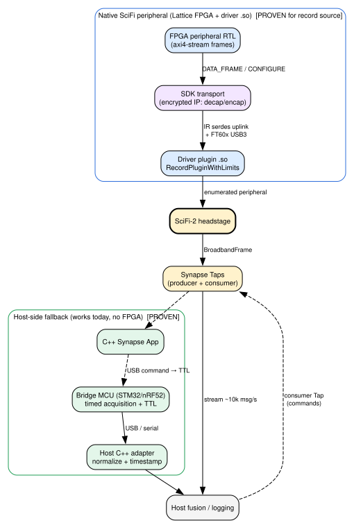

# Feasibility: NML Synapse Bridge implementation path

This document turns the protocol findings in
[`axon-peripheral-protocol.md`](axon-peripheral-protocol.md) into a build
decision. It is a **first-pass feasibility assessment**, explicit about what is
proven versus unknown. Tags as in the protocol doc:
**[PROVEN] / [DOC] / [INFER] / [UNKNOWN]**.

## The decision that dominates everything

The public reference (`vendor/axon-peripheral-example`) shows a custom
peripheral as **FPGA gateware inside the SciFi's own Lattice fabric + an ARM64
driver `.so` that runs on the SciFi**. The peripheral talks AXI4-Stream to an
encrypted SDK transport; it never speaks USB. [PROVEN — see protocol doc §0, §8]

There is **no public evidence** of a supported path by which an external MCU on
the SciFi's peripheral-facing USB/Axon port enumerates as a Synapse peripheral.
[PROVEN absence — protocol doc §2–4, §13]

Therefore the three candidate platforms are **not equivalent implementations of
one known interface.** Two of them (STM32, nRF52) presuppose an interface that
the reference does not document. This must gate the decision.



*Solid edges are proven/available; dashed edges are the host-fallback command
path (Option D). See `diagrams/bridge-architecture.dot` for the source.*

---

## Option A — Reproduce the reference: Lattice FPGA gateware + driver plugin

**Viability: [PROVEN viable]** — this is literally the shipped, known-working
example, and the bench has already run its data path end-to-end at ~10k msg/s.

- **Toolchain:** Lattice **Radiant 2024.2**, licensed, in Docker; ARM64 vcpkg
  container for the driver. [PROVEN: both Dockerfiles]
- **Proprietary dependencies:** encrypted Lattice IP (`decap/encap/transport
  .enc.v`) + a Radiant license (`LM_LICENSE_FILE`). Radiant **Free** license
  covers small Lattice parts; whether it covers the `via-devkit` target device
  and the encrypted transport IP is **[UNKNOWN]** until the exact device is
  identified. [PROVEN dependency; UNKNOWN license tier]
- **Physical target:** the `via-devkit` board — a Lattice FPGA carrying a 48 MHz
  oscillator, an **nRF radio bridged over SPI**, and an **IR/optical serdes
  uplink** to the headstage. [PROVEN: `via_top.sv:21-31, 161-166`] Obtaining
  this devkit is a prerequisite and is **[UNKNOWN]** (not on the current bench;
  bench has SciFi-2 + Axon Omnetics + STM32 + XIAO only).
- **Effort:** lowest *protocol* risk (contract is proven), highest *tooling* and
  *hardware-acquisition* risk (Radiant licensing + a Lattice board we do not
  have).

**Exact FPGA family/device:** target profile `via-devkit`, Radiant 2024.2.
The specific Lattice device string is **[UNKNOWN]** — it is baked into the
SDK-owned framework region of `scir_sdk.pdc`/`.rdf`/`.sty`, and the vendored
`.rdf` carries only a checksum header, not a human-readable part number in the
files we inspected. Resolve by opening `src/gateware/src/scir_sdk.rdf` /
`.sty` on a machine with the SDK, or by asking Science. [UNKNOWN]

## Option B — STM32 NUCLEO-U5A5ZJ-Q as a USB "custom peripheral"

**Viability: [UNKNOWN — blocked on a protocol question], not proven.**

- The STM32U5A5 is *technically* more than capable: USB HS, plentiful DMA,
  high-resolution timers, multiple ADC/SPI/I2C/UART, deterministic GPIO. Raw
  bandwidth and timing are **not** the limiting factor. [INFER from datasheet
  class; not the constraint]
- The blocker is **interface admissibility**, not capability: the reference
  gives no USB descriptor set, endpoint map, enumeration handshake, or framing
  that a peripheral-side device implements. An STM32 cannot "implement the Axon
  peripheral protocol" because that protocol, at the USB boundary, is **not
  public** (protocol doc §2–5). [PROVEN absence]
- Do **not** start writing STM32 USB-device firmware against a guessed Axon
  wire format. That is exactly the "invent an undocumented packet layout"
  failure the task warns against.

**Where the STM32 is immediately useful regardless:** as the MCU behind the
**host-side fallback** (Option D) and as the eventual **TTL/trigger + sensor
front end**. Its role is high-confidence; only its role *as a native SciFi
peripheral* is unproven.

## Option C — XIAO nRF52840 Sense as a USB "custom peripheral"

**Viability: [UNKNOWN — same block as B, plus tighter USB], not proven.**

- Same admissibility blocker as Option B.
- Additionally USB **Full-Speed only** (12 Mbit/s) via TinyUSB, less RAM/flash,
  coarser timers. If a native USB peripheral path *did* exist and required
  High-Speed bulk throughput, the XIAO would be marginal; for a 2-channel
  1 kHz deterministic harness it would be sufficient. [INFER]
- Distinct strategic value: the reference board already bridges an **nRF radio
  over SPI into the FPGA** (`via_top.sv:26-31`). The nRF52840's real leverage
  here is **BLE-central for future wristband/wireless-gateway** integration on
  the *host adapter* side, not as a SciFi peripheral. [PROVEN board feature;
  INFER role]

## Option D — Host-side fallback (works today, no unknowns)

**Viability: [PROVEN viable]** — depends only on proven Synapse mechanisms.

```
auxiliary sensor / MCU  ──USB/serial──▶  host C++ adapter
                                              │  (normalize to common
                                              ▼   timestamped record)
SciFi Taps (broadband, app_logs) ─────▶  host fusion
                                              │
                        Synapse consumer Tap ◀┘  (commands, e.g. TTL requests)
                                              ▼
                              C++ Synapse App ──▶ (any on-device action)
```

- Producer Taps stream neural data to the host; **consumer Taps accept data**
  such as stimulation commands. [DOC: `tap.h:14-20`]
- The MCU (STM32 first) is a plain USB/serial device to the host, with its own
  hardware-timed TTL outputs and sequence/timestamped acquisition. No SciFi
  peripheral protocol needed. [INFER — standard host peripheral]
- This satisfies the project's near-term goals (deterministic synthetic
  streams, GPIO event timestamping, host fusion, sync diagnostics) **without**
  resolving the FPGA/USB unknowns.

The one thing Option D **cannot** natively give is jitter-free trigger timing
referenced to the *SciFi/Axon* timebase — host/WiFi scheduling jitter sits in
the command path. That is precisely what the cross-timebase GPIO experiment
(shared physical edge into both MCU timer and SciFi GPIO) is designed to
*measure and correct*, so it is a bounded, characterisable limitation rather
than a blocker. [INFER]

---

## Recommendation (first pass)

1. **Proceed on Option D now.** It is fully supported, unblocks the entire
   synchronization/fusion program, and makes the STM32 immediately useful in the
   role it is unambiguously good at (timed TTL + sensor front end behind a host
   adapter). No new hardware or licenses required.
2. **Treat Option A (Lattice FPGA) as the only proven *native*-peripheral path**
   and gate it on two answers: (a) the exact Lattice device + whether Radiant
   Free suffices, and (b) whether a `via-devkit` (or equivalent Lattice board
   with the Axon transport) can be obtained. Do **not** install Radiant or
   request licenses until those are answered.
3. **Do not begin STM32/nRF52 USB-peripheral firmware** until Science confirms
   whether any external-MCU-as-SciFi-peripheral path exists (protocol doc open
   question #3). Until then, B and C are speculative for the *native* role.
4. **nRF52840's near-term value is BLE-central on the host side**, matching the
   board's existing nRF-over-SPI bridge concept — schedule it after the Option D
   harness works.

## Native bidirectional source + stimulation — is it possible?

- **Source (record):** [PROVEN yes] — the example is one.
- **Stimulation sink on a custom peripheral:** [UNKNOWN] — Synapse defines
  stim nodes/types and bidirectional Taps, but no vendored SDK sink-plugin base
  or example exists (protocol doc §13). Advance scheduling is only hinted at by
  `OpticalStimFrame.timestamp_ns`/`duration_us` and is unconfirmed (§14).
- **Net:** a *native* record-source bridge is achievable (via Option A); a
  *native* stim/trigger sink is unproven and must be confirmed with Science
  before committing firmware/gateware effort to it. The **host-fallback trigger
  path (Option D) is available now** for TTL control of external hardware.

## FPGA / Radiant — necessary?

- For **reproducing the reference native peripheral:** yes, Radiant 2024.2 +
  Lattice fabric are required, and encrypted Lattice IP is instantiated.
  [PROVEN]
- For **the project's near-term goals:** no — Option D needs no FPGA at all.
- **Open-toolchain reproduction** (yosys/nextpnr) is **not** feasible as-is: the
  transport is delivered as **encrypted** Verilog IP, so the design cannot be
  fully rebuilt outside Lattice's flow without Science providing source or an
  open-toolchain equivalent. [PROVEN: `.enc.v` files]

## Decisions needed from the user before going further

1. **Acquire a Lattice `via-devkit` (or equivalent Axon-transport board)?**
   Native-peripheral work (Option A) is impossible without it. If no, we commit
   to Option D and defer native peripheral entirely.
2. **Ask Science the five open questions** (protocol doc), especially #3
   (external-MCU peripheral path) and #1 (custom stim sink)? Their answers
   collapse most of the B/C/A uncertainty.
3. **Confirm the target for the first milestone is the host-fallback harness
   (Option D) on the existing bench** (SciFi-2 + Virtual Recording Peripheral
   ID 1000 + STM32 over USB to host), rather than a native custom peripheral.
