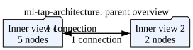

# hls4ml → Lattice Radiant backend, with Science Axon integration

This document records the architecture, exact revisions, build path, and measured results for an hls4ml `RadiantBackend` that turns a small neural network into synthesizable SystemVerilog and builds it with Lattice Radiant for the Science Via/Axon development FPGA. It also records the Science-specific passive tap that feeds the actual generated inference RTL and a threshold/refractory trigger path. The checked-out Science gateware is Via/RHD-oriented; it is not a NYX/Nixel acquisition implementation.

Written for: an engineer picking this work up — someone who knows hls4ml exists but has not seen this backend, and who needs to reproduce the numbers or decide what to upstream.

## 1. What was built, and where

Two clearly separated layers, matching the split the task requires:

1. **Generic, upstreamable `RadiantBackend` in hls4ml** (`third_party/hls4ml`,
   branch `feature/RadiantBackend`). It carries no dependency on Science
   hardware, Synapse, Axon, or any board. It reuses the existing XLS backend's
   (pure-Python, tool-free) SystemVerilog generation and adds a Lattice Radiant
   project/Tcl generator, a `radiantc` build driver, and a report parser.

2. **Science-specific integration in ScienceXYZ** (`host/hls4ml_radiant/`, not
   vendored). A parameterized AXI-stream wrapper that adapts the Axon peripheral
   SDK frame contract to the generated core's parallel-vector interface, plus a
   hardware-free cocotb harness. This is the hardware-backed *consumer* of the
   generic backend, never part of hls4ml.

### hls4ml files (new)

| File | Purpose |
| --- | --- |
| `hls4ml/backends/radiant/radiant_backend.py` | `RadiantBackend(XLSBackend)`: config, flows, `build()`. |
| `hls4ml/backends/radiant/__init__.py` | Package marker. |
| `hls4ml/writer/radiant_writer.py` | `RadiantWriter(XLSWriter)`: writes the XLS design **plus** the Radiant `.sdc` and `build_radiant.tcl`. |
| `hls4ml/report/radiant_report.py` | `parse_radiant_report()`: parses Synplify/Radiant reports into a plain dict. |
| `test/pytest/test_radiant_backend.py` | Registration, config, RTL-gen, numeric-equivalence, synthesis (gated). |
| `test/pytest/test_radiant_report.py` | Offline report-parser tests against checked-in real-report fixtures. |
| `test/pytest/test_report/Radiant/*` | Real report fixtures captured from a Radiant 2026.1 build. |

Registered in `backends/__init__.py`, `writer/__init__.py`, `report/__init__.py`.

### ScienceXYZ files (new)

| File | Purpose |
| --- | --- |
| `host/hls4ml_radiant/gateware/hls4ml_axon_peripheral.sv` | Parameterized host-driven Science AXI-stream wrapper. |
| `host/hls4ml_radiant/gateware/ml_sample_tap.sv` | Passive `DATA_FRAME` parser; never drives acquisition `tready`. |
| `host/hls4ml_radiant/gateware/ml_feature_engine.sv` | Source-independent canonical sample-event to 8-feature adapter. |
| `host/hls4ml_radiant/gateware/radiant_hls4ml_canary_generated.sv` | Actual hls4ml/XLS-generated `__myproject__myproject` RTL used by the tap. |
| `host/hls4ml_radiant/gateware/radiant_hls4ml_canary.sv` | Thin port adapter around the generated module. |
| `host/hls4ml_radiant/tests/radiant_canary_reference.py` | Exact signed fixed-point reference for the generated weights. |
| `host/hls4ml_radiant/synthesis/` | Reproducible integrated and standalone Radiant Tcl/SDC entry points and measured-result notes. |
| `host/hls4ml_radiant/tests/tb/axi4_stream_interface.sv` | Contract-faithful shim of the SDK interface (SDK copy is closed/read-only). |
| `host/hls4ml_radiant/tests/tb/hls4ml_core_stub.sv` | Deterministic test double for the separate request/response wrapper. |
| `host/hls4ml_radiant/tests/tb/hls4ml_axon_peripheral_tb.sv` | Testbench top binding flat AXI signals to the interface. |
| `host/hls4ml_radiant/tests/test_hls4ml_axon_peripheral.py` | cocotb tests: frame-in → inference → frame-out, edges, back-to-back, backpressure. |

## 2. Architecture decision: subclass the XLS backend

The initial hypothesis — reuse the XLS RTL generation and layer Radiant on top — was confirmed by inspecting the current hls4ml architecture:

* The **XLS backend** (`hls4ml/backends/xls`, upstream PR #1475) generates
  SystemVerilog **in pure Python** via the `xls-python` package
  (`pkg.schedule_and_codegen(...).get_verilog_text()`). Its `build()` stops at a
  `.sv` file; it invokes no vendor EDA tool for RTL. It supports `io_parallel`
  only (verified). This is exactly the generator to reuse.
* The **Libero backend** (`hls4ml/backends/libero`) is the vendor-toolflow
  precedent for `build()` returning a parsed report dict, but it is a full
  ~900-line C-HLS writer generating its own HDL — the "reimplement a NN code
  generator" path the task says to avoid.

`RadiantBackend` therefore **subclasses `XLSBackend`** and overrides only:

* `create_initial_config()` — Lattice Nexus part defaults, Radiant project
  options (`Synthesis`, `Top`, `ClockName`, `ExtraSources`, `BuildStage`).
* `build()` — generate RTL via `super().build()` (the reused XLS codegen), then
  run `radiantc` and parse the report.
* `_register_flows()` — a `radiant:`-namespaced mirror of the XLS flow, so the
  backend is independently discoverable as `backend="Radiant"` while reusing
  every XLS optimizer implementation.
* `_init_file_optimizers()` — walks the full class MRO so the shared
  `FPGABackend` passes (e.g. `xnor_pooling`) register under the `radiant:`
  namespace. (The base implementation only walks direct bases + self, which for
  a two-level subclass misses `FPGABackend`.)

The `RadiantWriter` is selected automatically because `self.name == 'Radiant'` resolves `get_writer('Radiant')`.

Why built-in rather than an external plugin: the branch targets an upstreamable `backend="Radiant"`, and every other RTL/vendor backend (XLS, Libero, Coyote) is built-in and registered the same way. The `hls4ml.backends` entry-point plugin mechanism exists and would also work, but built-in matches the surrounding code and is the cleaner upstream target.

## 3. Exact revisions and target

* **hls4ml**: `Neuro-Mechatronics-Interfaces/hls4ml`, branch
  `feature/RadiantBackend`, base commit `0a304519` (identical to upstream
  `fastmachinelearning/hls4ml` `main` at audit time; no prior Radiant work
  existed). XLS backend present (PR #1475), `xls-python` extra `>=0.1.9875`.
* **Axon SDK reference**: `vendor/axon-peripherals` @ `afafa38` (branch
  `m053m716/intan`), treated read-only. Ground-truth files:
  `src/gateware/src/scir_sdk.rdf`, `.sdc`, `.pdc`, `src/gateware/peripheral.yaml`,
  `src/gateware/src/via_top.sv`, `src/gateware/src/axon_test_source_peripheral.sv`.
* **FPGA target**: `LIFCL-17-9SG72C`, performance grade `9_Low-Power_1.0V`,
  package `QFN72`, operation `COM`, family CrossLink-NX / Nexus (`family_int
  je5d00`). Synthesis `synplify` (Synplify Pro), HDL `System Verilog`, top
  `via_top`.
* **Radiant**: the `.rdf` was generated by Radiant `2024.1.1.259.1`, but
  `peripheral.yaml` (`build.radiant_version: '2026.1'`) and
  `Dockerfiles/gateware.Dockerfile` (`ARG RADIANT_VERSION=2026.1`) target
  **2026.1**, and the host install used here is **Radiant 2026.1.0.37.0**
  (`radiantc.exe`). The 2026.1 environment is the authority; the version in the
  checked-in `.rdf` is stale metadata.

### 3.1 Clock: a discrepancy worth stating plainly

The task states an "80 MHz / 12.5 ns Science peripheral clock". The gateware tells a more precise story (`via_top.sv`, `scir_sdk.sdc`):

* `clkmc = 40 MHz (25 ns)` — SoC + **peripherals**. The user peripheral
  `u_user_axon_test_source` is clocked by **`clkmc` (40 MHz)**.
* `clksdr = 80 MHz (12.5 ns)` — serdes TX. The SDK's cocotb testbench also
  clocks the peripheral at **12.5 ns** (`CLK_PERIOD_NS = 12.5`).

So 80 MHz / 12.5 ns is the correct **simulation and serdes** clock and a sound constraint target, but the *shipping user-peripheral domain is 40 MHz*. A core meant to sit behind the real peripheral must ultimately close timing at 40 MHz. The backend defaults to 12.5 ns and lets the caller set `clock_period=25.0` for the `clkmc` domain.

## 4. Minimum validation model

A deterministic EMG-decoder-shaped MLP, no download, fixed RNG seed:

```
8 inputs → Dense(16) → ReLU → Dense(8) → ReLU → Dense(4)
```

Weights are `round(uniform(-0.5,0.5), 3)` / biases `round(uniform(-0.25,0.25), 3)` from `numpy.random.default_rng(1234)`. Fixed-point via hls4ml `ap_fixed<W,I>`. The test fixture lives in `test/pytest/test_radiant_backend.py::_tiny_dense_model`.

## 5. Build path

```
Keras model
  └─ hls4ml.converters.convert_from_keras_model(backend="Radiant", part=..., clock_period=...)
       └─ hls_model.write()      # XLS DSLX design + Radiant .sdc + build_radiant.tcl
       └─ hls_model.compile()    # XLS JIT: firmware/<proj>.opt.ir  (also the SW/emulation model)
       └─ hls_model.build()      # XLS codegen → firmware/<proj>.sv, then radiantc build_radiant.tcl → report
```

`build_radiant.tcl` uses only the long-standing `prj_*` Tcl commands (`prj_create`/`prj_add_source`/`prj_set_impl_opt`/`prj_run`). Stages are selectable via `build_stage` / `build(stage=...)`: `synthesis` (default), `map`, `par`, `bitstream`.

**Why synthesis-only is the default for a bare core.** A bare hls4ml core exposes its *entire* feature and result vector as top-level ports (e.g. 64 input
+ 80 output + clk = 145 pins for the 8-bit model). LIFCL-17-QFN72 has ~39 usable
PIO, so **map/PAR of the un-wrapped core fails I/O fitting even though the logic
fits easily** (see §7). Synthesis alone yields real LUT/DSP/FF and Fmax for the
core-as-IP; full map/PAR/bitstream is meaningful only for a pin-frugal *wrapped*
design (the Science peripheral, §8) or with `extra_sources`.

`radiantc` returns exit code 0 even when a `prj_run` stage fails, so `build()` also scans the console log for `failed` / `doesn't fit into device` and raises on either.

### 5.1 Environment split (this bench)

* `xls-python` ships Linux-only manylinux wheels, so **RTL generation runs under
  WSL Ubuntu** (a dedicated venv `~/.venvs/hls4ml-radiant`, Python 3.13, with
  `hls4ml[xls]`, Keras 3 + TF-CPU, `quantizers`).
* **Radiant synthesis runs from the Windows install** (`radiantc.exe`, `LM_LICENSE_FILE` set). There is no Linux Radiant at `/c/lscc/radiant-linux`, so the SDK's Docker gateware build (which bind-mounts that path) is blocked
  here; that only affects the full SDK project build (§8), not the backend.

## 6. Numerical validation

For every layer the same input vectors are compared:

```
Keras (float) → hls4ml XLS emulation (fixed-point) → RTL (generated .sv)
```

* **Keras vs XLS emulation** (the XLS JIT, run via `hls_model.predict`) is exercised over zero, sign-mixed, near-saturation and range-edge vectors in `test_radiant_numeric_equivalence_deterministic`. The emulation is bit-exact run-to-run (`assert_array_equal` on two predicts). Against Keras the max absolute error is the fixed-point quantization error: **≈ 0.008 at `ap_fixed<16,6>`** (10 fractional bits over 3 dense layers) and **≈ 0.47 at `ap_fixed<8,4>`** (4 fractional bits — lossy, used only for the fit test). The test asserts `< 0.05` at `ap_fixed<16,6>`.
* **RTL vs emulation**: the generated `.sv` is the same XLS IR used by the JIT, and the integrated tap now directly simulates that generated module. The cocotb test compares all four RTL outputs for a sign-mixed vector against the exact integer reference in `radiant_canary_reference.py`, then observes the valid and trigger events. The separate request/response tests still use their explicit deterministic stub.

## 7. Timing and resource results (measured, not assumed)

**Current validation (2026-09-17):** The earlier figures in this section that
describe a 7389-LUT core at an 80 MHz request are superseded. The checked-in
generated core measures 1857 LUT4, 205 FF, 0 DSP, 0 EBR, and 0 LRAM at
Radiant 2026.1 synthesis with a 40 MHz SDC. Estimated Fmax is 34.3 MHz,
29.125 ns, and worst slack is -4.125 ns. The bare core therefore fails the
real 40 MHz peripheral clock. The integrated tap top measures 1633 LUT4,
1234 FF, 0 DSP/EBR/LRAM, 428 I/O, and estimated 62.2 MHz with +8.911 ns
slack; this contextual result is not additive with the standalone core and
does not prove the bare core closes. Its generated-core critical path is
15.879 ns with 25 logic levels. Final place-and-route was not completed.

Radiant 2026.1.0.37.0 synthesized the checked-in generated core (`ap_fixed<8,4>`, LIFCL-17-9SG72C, 40 MHz / 25 ns request). The standalone report is `synthesis/radiant_canary_core_impl_1.srr` in the local build tree:

| Metric | Value |
| --- | --- |
| Part | LIFCL-17-9SG72C |
| LUT4 | 1857 / 13824 (13.4%) |
| Registers (FF) | 205 / 13824 (1.5%) |
| DSP (18x18) | 0 / 24 |
| EBR / LRAM | 0 / 24, 0 / 5 |
| Requested clock | 40 MHz (25 ns) |
| **Estimated Fmax** | **34.3 MHz (29.125 ns)** |
| **Worst slack** | **-4.125 ns** |
| Timing met | **No** |
| Inference latency | 2 registered boundaries; one combinational network between them |

Two findings are surfaced, not hidden:

1. **The bare, single-cycle-combinational MLP does not meet the real 40 MHz peripheral clock** (estimated 34.3 MHz, -4.125 ns). The cause is that XLS schedules the whole MLP into one combinational cloud between the input and output flops, because its `asap7` (7 nm ASIC) delay model vastly under-counts Lattice LUT4 delay. **This is now resolved by pipelining** (see §7.1): requesting a tighter `clock_period` forces the XLS scheduler to insert internal pipeline registers, and every pipelined variant closes 40 MHz. The checked-in core is the 3 ns / 4-stage variant at 81.5 MHz / +12.7 ns.
2. **Standalone map fails on I/O, not logic**: 145 top-level pins versus 39 available PIO. This is an IP-top limitation; the core is measured at synthesis and as a sub-module in the integrated top.

### 7.1 Pipeline sweep — closing 40 MHz (2026-09-18)

Regenerating the same 8->16->8->4 model at a tighter requested `clock_period`
(forwarded to XLS's `clock_period_ps`) makes the scheduler insert pipeline
stages. Measured on LIFCL-17-9SG72C at the real 25 ns SDC (Radiant 2026.1),
same weights/precision/I/O each time; only latency (= stages - 1) changes:

| Gen period | Stages | Latency | LUT4 | FF | Est. Fmax | Slack @25 ns | Meets 40 MHz |
| --- | ---: | ---: | ---: | ---: | ---: | ---: | :---: |
| 12.5 ns (flat) | 2 | 1 | 1857 | 205 | 34.3 MHz | -4.125 ns | no |
| 6 ns | 3 | 2 | 1292 | 189 | 49.8 MHz | +4.909 ns | yes |
| 4 ns | 3 | 2 | 1440 | 1067 | 56.0 MHz | +7.158 ns | yes |
| **3 ns (applied)** | **4** | **3** | **1274** | **761** | **81.5 MHz** | **+12.736 ns** | **yes** |
| 2 ns | 5 | 4 | 1266 | 870 | 88.6 MHz | +13.711 ns | yes |
| 1.5 ns | 7 | 6 | 885 | 1591 | 134.2 MHz | +17.547 ns | yes |
| 1 ns | 10 | 9 | 1095 | 2579 | 141.1 MHz | +17.913 ns | yes |

The 3 ns / 4-stage variant is checked in as the generated core and is
cocotb-verified (11/11, exact `[-72,-30,-130,-24]`, 3-cycle latency) under
Icarus 12. Tooling: `host/hls4ml_radiant/tools/pipeline_sweep_gen.py` (WSL RTL
generation) and `characterize_sweep.ps1` / `characterize_core.tcl` (Windows
Radiant synthesis). See `host/hls4ml_radiant/synthesis/README.md` for the
integration notes (the `CORE_LATENCY` valid pipe and the Icarus-portable
element-wise flop rewrite).

## 8. Science Axon integration

`host/hls4ml_radiant/gateware/hls4ml_axon_peripheral.sv` adapts the SDK frame contract to the core. Interface verified against `axon_test_source_peripheral.sv`: ports `clk`, `rst` (sync active-high), `periph_addr[31:0]`, `rx_axis` (`axi4_stream_interface.secondary`), `tx_axis` (`axi4_stream_interface.main`); one 32-bit word per beat, header word = `{msg_type[31:16], len_bytes[15:0]}`, `tlast` on the final beat.

Message protocol (explicit, versioned constants):

* `INFER_REQUEST (0x0060)` — `N_IN` payload words, low `IN_W` bits of word *i* = feature *i*.
* `INFER_RESULT (0x0061)` — `N_OUT × ceil(OUT_W/32)` little-endian words carrying each signed fixed-point output.

Dataflow for the host-driven wrapper is `AXI stream -> input frame decoder -> feature vector -> hls4ml core -> output vector -> output frame encoder -> AXI stream`. The separate live-tap path is `DATA_FRAME -> passive parser -> canonical sample events -> 8-feature engine -> actual __myproject__myproject RTL -> selected score -> threshold/refractory FSM -> trigger`.

The request/response cocotb harness (`test_hls4ml_axon_peripheral.py`) is hardware-free and intentionally uses a deterministic stub. The live-tap harness (`test_ml_tap_peripheral.py`) compiles the generated RTL source itself, drives acquisition frames, checks exact fixed-point scores, and covers trigger, refractory, overrun, disabled, reset, and passive-bus behavior.

Result: all four cocotb tests pass under Icarus Verilog 14 (`test_single_inference`, `test_edge_vectors`, `test_back_to_back`,
`test_backpressure`), with every output matched *exactly* (not argmax) against the software reference. Bringing them up caught two real wrapper bugs recorded in `MISTAKES.md` (2026-09-17): a SystemVerilog width-cast precedence error that doubled every output (`N*W'(x)` parses as `N*(W'(x))`), and a back-to-back frame that overwrote the pending result because `tready` was gated one cycle too late. Both are fixed; the wrapper now backpressures input the instant a request completes and holds one inference in flight at a time.

## 9. Full Science Radiant project (Milestone D / operator step)

The SDK's supported way to add user RTL is `peripheral.yaml` (`fpga.module` / `fpga.sources` / `fpga.constraints`), **not** hand-editing the generated `scir_sdk.rdf`. A validation project would list `via_top.sv`, the Science transport/framework RTL, the `hls4ml_axon_peripheral` wrapper, the generated core `.sv`, the PDC/SDC, and the Science IPX, targeting `LIFCL-17-9SG72C` with the Synplify/Radiant flow.

On this bench the SDK gateware build runs in the `gateware.Dockerfile` image, which bind-mounts a **Linux** Radiant copy that is not installed here, so the full `.deb`/bitstream build is **pending an operator**. The agent does not run `synapsectl` or deploy. When the environment is ready the operator-run build is (exact form to be confirmed from current SDK help before use):

```
synapsectl peripherals build both <project-dir>
```

Treat the bitstream/deploy as a separate acceptance stage from synthesis.

## 10. Limitations and next steps

* `io_parallel` only (inherited from XLS); `io_stream` is out of scope.
* The bare *flat* generated MLP missed the real 40 MHz clock; **resolved** by pipelining via a tighter requested `clock_period` (§7.1). The checked-in core is the 3 ns / 4-stage variant (81.5 MHz, cocotb-verified). No smaller/restructured model was needed — the failure was path depth, not area.
* RTL-vs-emulation is directly checked for the live tap: the cocotb test compiles the generated source and compares all four outputs to an independent integer reference. The separate request/response wrapper retains its explicit stub test.
* Full map/PAR and a bitstream require the wrapped, pin-frugal project (§8/§9), which is operator-run here.
* A pre-existing **XLS backend** bug was found and left alone (out of scope): `xls_writer.py` hard-codes `myproject_bits` in the top-level DSLX call, so a non-default `project_name` breaks `compile()`. Use the default project name, or fix upstream separately.

### 10.1 XLS Dense, pipeline, and resource-sharing investigation

The checked-out XLS path selects the `pipeline` generator with input and output
flops. Dense lowering transposes weights and emits the XLS dot-product
implementation. The current XLS path has no evidence that hls4ml's
Vivado-style `ReuseFactor` or `Strategy: Resource` controls create shared
Dense multipliers. The generated canary confirms that one unrolled
Dense/ReLU network remains between the input and output registers.

No resource-sharing implementation or pipeline sweep was added in this focused
validation. The next timing experiment should add a real stage boundary
between Dense operations and propagate valid latency through the tap. Resource
sharing is a separate throughput/resource tradeoff and must be measured against
the same exact fixed-point reference.

## 11. Future extension — Nyx1-512 acquisition on the same FPGA

A question arose about also mediating a Science **Nyx1-512** neural interface IC (up to 512 channels at up to 2 kHz) on the same FPGA. This is **orthogonal** to the generic inference core and does **not** change the `RadiantBackend`: it adds a *separate* Science-specific acquisition subsystem (a sibling of the AXI wrapper), and it changes the device budget. Grounded in the Science docs (`ic-nyx1-512/ hardware-integration`, `ic-nyx1-512/electrical`, `adapt-nerv/electrical`):

* The Nyx1-512 **requires an FPGA** (Science provides a reference implementation); an MCU cannot meet its timing.
* Digital interface: **4-wire SPI control** (32-bit command/address/data words, 40 MHz SCLK, 48 SCLK per transaction) + **four SDR serial data lanes** (`data_ser_out<3:0>`, ≤ 160 Mbit/s each) + **four word clocks** (`wclk_ser_out<3:0>`, 16:1 deserialization) + an FPGA-generated **system clock ≤ 160 MHz with < 50 ps RMS jitter** + `rstb` (low ≥ 6 ms at power-up).
* Electrical: all digital I/O is **1.2 V LVCMOS single-ended** (not LVDS) — the FPGA needs a 1.2 V `VCCIO` bank or level translation. This is the key gate.
* 512 electrodes, configurable 10–16 bit, 2–32 kHz. The **2 kHz target maps to ADC Mode-4 (16-bit), which still requires a 160 MHz system clock** (single-slope ADC timing, not throughput). Aggregate at that point is only 512 × 16 × 2k ≈ 16.4 Mbit/s across four lanes — trivial versus the 4 × 160 Mbit/s raw capacity.
* The **Axon NeRV adapter** breaks the raw Nyx1 signals out on a 34-pin connector at 1.2 V (CLK 19, RSTB 21, SCLK 23, CS 24, SDIN 22, SDOUT 20, DATA0–3, WCLK0–3); in Science's own stack the FPGA lives in the SciFi headstage.

Device-budget implication, using this project's measured numbers: the Nyx1 front end is small in logic (Science estimates "< 5k LUT4 avg"), but a *512-channel decoder core* is far larger than the current 1857-LUT canary, which already misses the real 40 MHz clock. On a LIFCL-17 the realistic split is **acquisition + framing on the FPGA, decode on the host**; on-FPGA inference for 512 channels points to a larger Nexus part (LIFCL-40 / CertusPro-NX). The backend already takes `part=...`, so retargeting is a config change, not a rewrite. Tracked as a non-blocking follow-up.

> **Reality check (2026-09-17).** The NYX1-512 above is documentation-derived. A
> reverse-engineering pass over the *actually checked-out* gateware found no NYX
> front end in this repository, and the settled bench fact
> (`docs/rhd2132-gateware-plan.md`, memory `axon-omnetics-is-physical-rhd2132`) is
> that the real probe front end is a **physical Intan RHD2132** driven over SPI by
> the SciFi-2 headstage Lattice FPGA — not a NYX serial IC. Section 12 documents
> the acquisition boundary that actually exists and builds the non-blocking ML tap
> against it. The NYX material here remains valid only as a *future-hardware*
> device-budget estimate; do not treat it as the current signal path.

## 12. Non-blocking ML sample tap on the real Science acquisition boundary

This section documents a second, distinct integration: an on-device inference
path that consumes the neural acquisition stream as a **read-only tap** and drives
a hardware trigger, *without* being in the acquisition datapath. It is grounded in
the gateware actually checked out in this repository, not in NYX documentation.

Written for: an engineer integrating on-device inference who must guarantee that
adding it cannot disturb neural recording.

### 12.1 The acquisition boundary that actually exists

A trace from the physical front end to the first coherent parallel sample vector,
using exact source names in `vendor/axon-peripherals` @ `afafa38`
(branch `m053m716/intan`, read-only):

* **No NYX serial front end is present.** There is no `DATA[3:0]`, `WCLK`,
  `data_ser_out`, config-SPI-to-NYX, or deserializer RTL anywhere in the checked-out
  tree (repo-wide search). The task's NYX `CS/SCLK/SDIN/SDOUT + CLK/RSTB +
  DATA[3:0]/WCLK[3:0]` interface does **not** appear in this gateware. This is the
  key "if the checked-out RTL differs, document the difference" finding: the
  documented NYX interface and the implemented interface differ completely.
* **The board is the Axon Via peripheral dev board, not the headstage.**
  `src/gateware/src/via_top.sv` top-level pins are only: `ext_xo_i` (48 MHz XO),
  `ir_txa_o`/`ir_txb_o` (IR TX), the nRF SPI bridge (`nrf_*`), and `en_ldo_o`.
* **Clock tree** (`via_top.sv:59-79`, `clk_gen`): 48 MHz XO → PLL `clk0` = 160 MHz;
  `clksdr` = 80 MHz (serdes TX); `clkmc` = `clk0/4` = **40 MHz** (SoC + peripherals).
  The user peripheral runs on **`clkmc` (40 MHz)** — this is the real integration
  clock, confirming §3.1.
* **The readable "sample bus" is a peripheral's `tx_axis` DATA_FRAME.** The Science
  transport (`decap`/`encap`/`transport`) is **IEEE-1735 encrypted** (Synplicity/
  Lattice keys; no plaintext ports), so the internal framing/serdes is opaque. The
  boundary that *is* readable and that carries assembled samples is the AXI-Stream
  interface between the user peripheral and `encap`.
* **The concrete sample representation** (`axon_test_source_peripheral.sv`, which is
  Science's own synthetic *neural* source and the driver-faithful contract):
  `MSG_DATA_FRAME = 0x0056`; frame = header word `{0x0056, len_bytes}` then
  `channel_count` payload words, each `{16'h0000, signed 16-bit sample}`,
  **channel-sequential** (word *i* = channel *i*), one frame per sample epoch,
  `tlast` on the final beat.
* **Physically**, the front end is a **Intan RHD2132** (32-ch SPI ADC, 16-bit
  two's-complement, **0.195 µV/LSB**, gain 192 V/V; `docs/rhd2132-gateware-plan.md`).
  The SPI-master gateware that would turn RHD MISO into these DATA_FRAMEs is planned,
  not yet written; the SDK's synthetic source emits the identical frame contract, so
  the tap is developed and verified against that contract today and is unchanged when
  the real RHD source replaces it.

Signal-flow (rendered from `docs/figures/ml-tap-architecture.dot`):



The 15-point acquisition-boundary checklist from the task, answered against this
gateware: (1) system clock = `clkmc` 40 MHz from `clk_gen`; (2) reset =
`rst_sync[1]` (PLL-lock + counter, synced to clkmc); (3–5) NYX config SPI / serial
DATA / WCLK — **not present** (RHD SPI is the real control/data path, in planned
gateware); (6–9) deserialization / word numbering / ADC bit depth / sample rate —
happen inside the **encrypted** transport for the stock path, or in the planned RHD
SPI master (16-bit, 32-ch, 20 kHz); (10) the coherent sample word becomes available
as a **DATA_FRAME payload word** on `tx_axis`; (11) the valid signal is AXI
`tvalid & tready` with `tlast` marking end-of-epoch — there is no separate
frame/sample/channel-valid; (12) buffering = the peripheral's own BRAM delay line;
(13) the only CDC is inside the encrypted transport (clkmc↔clksdr) — the user
peripheral and the tap are single-clock on clkmc; (14–15) conversion to Science's
stream and transport to host is the encrypted `encap`→serdes path. The tap attaches
at (10)/(11): after channel assembly, before transport — exactly the point the task
prescribes.

### 12.2 Why the tap cannot disturb acquisition

The tap is a **passive snoop**: `ml_sample_tap` takes `acq_tvalid`, `acq_tdata`,
`acq_tlast`, `acq_tready` as **inputs only** and drives **nothing** back onto the
acquisition bus. `tready` is deliberately not a tap output. Structurally this
realizes

```
acquisition capture ─► raw Science stream (tx_axis ─► encap ─► host)
                   └─► ML tap                       (read-only branch)
```

rather than putting the core in series. Holding `ml_enable = 0`, asserting `rst`,
or a stuck/faulted core cannot assert backpressure, reorder, or gate the neural
stream — the tap simply stops consuming. Two cocotb cases assert this directly:
`test_ml_disabled_acq_continues` (disabled: `frames_seen`/`samples_seen` still
advance, zero inferences, and the tb-owned `tready` is untouched) and
`test_ml_reset_acq_continues` (reset mid-stream: the bus keeps moving, the DUT
never drives `tready`, and inference resumes cleanly on release).

### 12.3 The chosen tap and the 8-feature adapter

ml_sample_tap (host/hls4ml_radiant/gateware/ml_sample_tap.sv) parses one
DATA_FRAME and emits canonical sample events: sample_valid, epoch_end,
sample_channel, and signed sample_value. It never drives acquisition tready.
ml_feature_engine is source-independent and consumes that canonical interface,
so a different source adapter can feed the same feature and trigger logic.

For each selected channel, the feature engine computes rectified magnitude and
a causal EMA, or the latest magnitude in passthrough mode. At an epoch boundary
it presents an 8-element feature vector to the model. A busy inference causes
only that inference to be skipped and counted; raw acquisition samples continue
to be observed.

The canary model explicitly uses IN_W=8: signed 16-bit acquisition samples are
saturated to 8-bit unsigned magnitudes before the ap_fixed<8,4> model. The
conversion is in the feature engine; it is not an implicit transport or
timestamp conversion.

### 12.4 Trigger FSM and latencies

ml_trigger_fsm selects a signed model output, applies the runtime threshold and
polarity, emits a registered pulse, and enforces refractory time. There is no
combinational score-to-trigger output path.

At 40 MHz (25 ns per clkmc cycle), the integrated cocotb probes measured:

| Stage | Cycles | Time | Evidence |
| --- | ---: | ---: | --- |
| Acquisition epoch cadence | 20,000 | 500 us | 2 kHz sample rate |
| Feature-window latency after final beat | 0 extra | 0 ns | next-state final-beat handling |
| feature_valid -> model input accepted | 1 | 25 ns | valid alignment pipe |
| Model input accepted -> model output valid | 1 | 25 ns | generated RTL boundary |
| Model output valid -> trigger decision | 1 | 25 ns | score register / FSM condition |
| Trigger decision -> trigger_out | 1 | 25 ns | registered FSM output |

The measured fabric path from the final feature event to trigger assertion is
4 cycles / 100 ns. The 2 kHz epoch cadence is 20,000 fabric periods, so
acquisition does not wait for inference.

### 12.5 Status / overrun observability

The tap exposes samples_seen, frames_seen, inferences_started,
inferences_completed, inferences_skipped, and ml_overrun; the FSM adds
trigger_count. Overrun is counted and raw sample observation is preserved.

### 12.6 Numerical validation (hardware-free)

test_ml_tap_peripheral.py runs 11 integrated tap tests under cocotb and Icarus
14 at 40 MHz. Its source list includes the actual generated
radiant_hls4ml_canary_generated.sv; the request/response test's
hls4ml_core_stub.sv is not used by this tap.

The sign-mixed feature vector [10,10,20,20,30,30,40,40] produces the exact four
signed outputs [-72, -30, -130, -24] from the independent integer fixed-point
reference. The test also checks threshold-at/below/above, refractory, busy
overrun, disabled acquisition, reset, and that the tap never drives acquisition
tready. The separate request/response wrapper tests remain 4/4.

### 12.7 Synthesis and resource delta (measured)

The current integrated open top synthesizes on LIFCL-17-9SG72C with Radiant
2026.1.0.37.0 and a 40 MHz SDC to:

| Scope | LUT4 | FF | DSP | EBR | LRAM | I/O |
| --- | ---: | ---: | ---: | ---: | ---: | ---: |
| Integrated tap top | 1633 | 1234 | 0 | 0 | 0 | 428 |
| Standalone generated core | 1857 | 205 | 0 | 0 | 0 | 145 |

The integrated Synplify estimate is 62.2 MHz (16.090 ns) with +8.911 ns
slack. The standalone generated core estimate is 34.3 MHz (29.125 ns) with
-4.125 ns slack, so the bare core fails the real 40 MHz clock. These totals
are different synthesis contexts and must not be added. No pipeline or
retiming sweep was performed.

The integrated map attempt reaches logic mapping but fails the validation
top's 428 I/O cells against 39 available PIO. No PAR or bitstream result is
claimed. The prior 412-LUT shell figure used a placeholder core and is not a
current full-path resource result.


### 12.8 Configurable vs adaptable, against Science control

* **Level 1 (runtime trigger config)** — implemented as ports: `ml_enable`,
  `threshold`, `trig_polarity`, `pulse_width`, `refractory_cycles`, `score_index`,
  and `chan_sel[]`. In a deployed peripheral these map naturally onto the SDK's
  existing CONFIGURE-style command frame (a `SET_*` opcode carrying the value), the
  same control plane §8's wrapper already uses — **no second control transport is
  introduced.**
* **Level 2 (runtime feature config)** — `chan_sel[]` and `feat_passthrough` are
  runtime; scaling/coefficients are not yet exposed (the EMA pole is a compile-time
  `ENERGY_SHIFT`). Adding them fits the same CONFIGURE mechanism when needed.
* **Level 3 (runtime model weights)** — **not supported by the generated core.** The
  XLS/Radiant flow emits weights as combinational constants, not writable memories
  (§10 and the XLS codegen). Runtime model replacement would require the core to be
  regenerated and rebuilt; do not promise on-the-fly weight loading. Host-trained /
  FPGA-rebuilt models are the supported update path; online training is not a goal.

### 12.9 Candidate physical trigger output

`trigger_out` is intentionally an **internal** signal — no package pin is assigned.
Whether a NeRV/mezzanine pin can be repurposed as an FPGA-driven trigger depends on
the actual PDC assignments, bank voltage (the RHD/Axon path is not 1.2 V-critical
like NYX), direction, and conflicts with the Science transport — none of which are
resolvable from this SDK (the transport is encrypted and the dev board exposes only
IR TX / nRF pins). Assigning a trigger pin is therefore an operator/bench step
against the headstage schematic, kept out of the generic tap.

### 12.10 What is simulation-only vs operator/bench

* **Verified here (sim + synthesis):** the tap, feature adapter, trigger FSM, all 11
  integrated tap tests at 40 MHz, and synthesis on the real part with resource/timing.
* **Operator/bench only:** the RHD2132 SPI-master source gateware (planned,
  `docs/rhd2132-gateware-plan.md`); the full Science Radiant project build to a
  `.bit` (blocked on this bench — no Linux Radiant for the SDK Docker image, §9);
  baseline acquisition utilization; any physical trigger-pin assignment; and every
  device/`synapsectl` action (the agent runs none).

### 12.11 What of this is suitable for upstream hls4ml

Nothing in section 12 goes upstream. The tap, feature adapter, trigger FSM, and Science
frame contract are all ScienceXYZ integration and must stay out of hls4ml (which
knows nothing of NYX/RHD/Science/AXI framing). The only upstream-relevant items are
the generic RadiantBackend (sections 1-2) and, separately, the pre-existing XLS
`project_name` bug (section 10) and optional core pipelining for timing closure (section 7).
