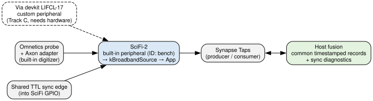
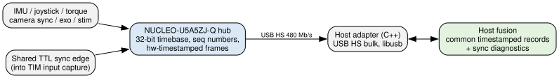

# Peripheral Source Plan — Axon Omnetics 32ch and STM32 Hub

Date: 2026-08-24. Status: proposed, pending user decisions in §8.

This document is the audit-derived plan for creating the two requested peripheral sources: (1) the physical Axon Omnetics 32-channel adapter, and (2) an STM32 NUCLEO-U5A5ZJ-Q interface board mediating cameras, joysticks, exoskeletons, stimulators, and analog/digital sensors (IMU, torque). Evidence tags follow `docs/axon-peripheral-protocol.md`: **[PROVEN]** (vendored code / verified web source), **[DOC]** (Science or ST documentation), **[INFER]**, **[UNKNOWN]**.

*Solid edges: proven/available paths. Dashed node: conditional Track C. Double-headed edges carry data up and commands down; the "shared TTL sync edge" node is the same physical edge in both figures. Sources: `diagrams/peripheral-source-scifi.dot`, `diagrams/peripheral-source-hub.dot`.*

---

## 1. The headline correction

The phrase "create a proper axon peripheral source rather than the synthetic example" conflates three separate things that this audit established are distinct:

1. **The physical Axon Omnetics adapter needs no custom peripheral work at all.** The adapter contains its own digitizer and enumerates as a firmware-provided built-in peripheral. Config-only recording is the documented path: "channel configuration is described in a Synapse JSON file (GitHub), which can be used with both Nexus software and the Synapse CLI" [DOC datasheet v1.3 p.5–6, verified verbatim]. Creating this source is a configuration-and-validation task (Track A), not a gateware/driver task.
2. **The synthetic example (`axon_test_source`) belongs to the Axon Peripheral SDK**, whose only gateware target is the **Via devkit** — a separate Lattice CrossLink-NX **LIFCL-17-9SG72C** board [PROVEN scir_sdk.rdf:3; DOC board-profiles page]. The SDK docs require "a Science headstage connected to an SDK-supported probe" and state the via-devkit profile "targets the user-programmable FPGA on the Via devkit" [DOC, verified verbatim]. We do not own a Via devkit; without one, a custom native peripheral cannot run regardless of licensing. This is Track C, gated on hardware acquisition, not on the Radiant license.
3. **The STM32 hub is a host-side device** (the previously decided Option D in `docs/feasibility-mcu-vs-fpga.md`). The SDK currently supports only record sources — "Axon Peripherals currently only support peripherals which extend the BroadbandSource class … Support for other peripheral classes, like Spike Source, and Stimulation sources will be added in the future" [DOC SDK overview, verified verbatim] — so even with a Via devkit, the STM32's command/actuator role could not be a native peripheral today. Track B builds it as a USB-HS device feeding host fusion.

Consequently, prior repo docs contain a now-known error: `docs/axon-peripheral-protocol.md` §0 and `docs/feasibility-mcu-vs-fpga.md` describe the custom-peripheral gateware as running "inside the SciFi's own Lattice fabric." The verified docs place the user FPGA on the **Via devkit**, on the probe side of the Axon link, not inside the SciFi-2. Correcting those passages is a Phase 0 item.

## 2. New verified facts this plan relies on

Adapter and Synapse (web research, adversarially re-verified):

- Adapter datasheet v1.3 specs: up to 32 single-ended channels, 3.8 Hz–14 kHz bandwidth, gain 13–200 V/V, 2.4 µVrms min noise, 10–16 bit depth, 2–32 kHz sampling, USB 3.2 Gen 1 serializer, Omnetics A79025-001; mating probe connector A79024-001/A79026-001 [DOC p.3–4].
- The datasheet self-contradicts on the digitizer chip: Overview says **Intan RHD2132**; Configuring/pinout say **Science NYX1-512** [DOC p.3 vs p.5–7, both verbatim]. The bench name `IntanRHD2132` (ID 200) matches the Overview. Which parameter table governs ID 200 is [UNKNOWN] → bench experiment + Science question.
- The Synapse peripherals page documents the recording parameter space under the NYX1-512 name: `bit_width` 12; `sample_rate_hz` ∈ {4000, 8000, 16000, 20000, 25000, 32000}; `low_cutoff_hz` ∈ {4, 57, 92, 154, 457}; `high_cutoff_hz` ∈ {4365, 13489, 20400}; gain discrete cutoff-tied values 13/138/179/200 V/V (defaults 92/13489); reference modes Differential/Global/Ground; `reference_id` values 512–520 are reference-electrode selectors. The Virtual Recording Peripheral accepts bit_width 12, 0–10000 Hz, and ignores gain/filters [DOC, verified].
- **The electrode map in `config/axon-omnetics-32ch.json` is the documented pinout.** The datasheet pin table (pins 3–34 → electrodes 122, 126, 116, 120, 110, 114, 104, 108, 98, 66, 92, 60, 86, 54, 80, 48, 74, 38, 68, 36, 62, 0, 56, 4, 50, 12, 44, 14, 42, 20, 32, 26; pins 1/36 GND, 2/35 REF) matches the config's channel 0–31 `electrode_id` sequence exactly: channel *k* = Omnetics pin *k+3* [DOC p.6–7 cross-checked against config]. This closes the "electrode map unverified" item in TODO.md, with one caveat: whether datasheet electrode numbering and the `Channel.electrode_id` namespace coincide is [INFER], to be confirmed the first time real data is recorded.

SDK and toolchain (local audit + verified web):

- The driver SDK (`scifi-peripheral-sdk` 0.2.0, headers extracted from the builder image) has exactly one plugin base: `RecordPlugin`/`RecordPluginWithLimits`; `PluginDescriptor` has a single factory slot returning a record peripheral (ABI v3). No stim/camera/spike base exists [PROVEN]. `parse_frame_payload` returns only samples; there is **no hook for a plugin to set `timestamp_ns`/`sequence_number`** on published frames — timestamps derive from the SDK's `SharedTimeSource` (`TIME_SOURCE_SAMPLE_COUNTER`) [PROVEN]. Any device-side timestamps we want preserved must travel out-of-band. This limitation must be stated wherever AGENTS.md's preserve-source-timestamps rule is applied to a native peripheral.
- `start_recording_impl` receives the full `std::vector<synapse::Channel>` including `electrode_id`/`reference_id` [PROVEN record_plugin.h:156-160]; the example discards all but the count.
- The SDK headers define a USB surface not mentioned in any doc: `USB_VENDOR_ID 0x2AC1`, `AXON_TERMINAL_PRODUCT_ID 0x0008`, bulk endpoints 0x01/0x02, 4096-byte max packet, `PeripheralId::AXON_TERMINAL = 0x8000` [PROVEN sdk axon/protocol.h:17-27,46]. First concrete evidence of a USB-attached Axon device class — a new question for Science (§7), not a supported public path.
- Radiant licensing is resolved at the family level: the Lattice free license fully covers CrossLink-NX (synthesize/map/PAR/**bitstream**), verified against Table 1 of the official Licensing User Guide (Oct 2025) [DOC]. The encrypted transport IP (`*.enc.v`) carries IEEE 1735 key blocks but **no license-verification pragmas** — any valid Radiant install decrypts it [PROVEN + INFER]. So the pending floating license is convenient, not load-bearing; a free node-locked license is a fallback.
- Peripheral-example build state: only the **driver** half is built (`dist/scifi-axon-test-source_0.1.0_arm64.deb` contains the `.so`s only, no `.bit`; no `.bit` exists anywhere in the tree) [PROVEN]. If that .deb was deployed, `0xF001` would still not enumerate — there is no fabric hardware behind it. The stream observed on the bench ("High Bandwidth", a UI label not found in any doc or code [UNKNOWN origin]) came from the virtual peripheral: the active config binds `peripheral_id: 1000`.

STM32 (web research, adversarially re-verified; st.com is unreachable from this network — facts verified from ST's GitHub, UM2861 Rev 2/Rev 8 mirrors, Zephyr/TinyUSB sources):

- NUCLEO-U5A5ZJ-Q = STM32U5A5ZJT6Q: Cortex-M33 @ 160 MHz, 4 MB flash (ECC), 2514 KB SRAM [DOC UM2861 Rev 8 Table 1].
- **USB OTG HS with integrated 480 Mbit/s PHY** — the only USB instance on the U5A5; device mode on the user USB-C connector **CN15** (PA11/PA12), no solder-bridge rework [PROVEN CMSIS header + CubeU5 CDC-ACM README + Zephyr dts].
- Four 32-bit timers (TIM2/3/4/5); ETR external trigger exists **only on TIM1/2/3/4/5/8** (not TIM15/16/17) [PROVEN `IS_TIM_ETR_INSTANCE`]. A 160 MHz 32-bit timebase (6.25 ns tick, 26.8 s wrap, extended to 64-bit in the overflow ISR) with input-capture channels can hardware-timestamp async edges.
- ADC1/ADC2 14-bit 2.5 Msps (hardware oversampling, timer-triggered), ADC4 12-bit low-power; 3 SPI, 6 I2C FM+, 7 U(S)ARTs, FDCAN1, DCMI+PSSI camera parallel input, SDMMC×2, OCTOSPI×2+HSPI; **no Ethernet** [PROVEN header grep].
- Firmware stacks: STM32CubeU5 ships USBX `Ux_Device_CDC_ACM`/`Ux_Device_DFU` for this exact board; TinyUSB supports it (`stm32u5a5nucleo`, DWC2) [PROVEN].
- Power: device-mode VBUS from CN15 up to 1 A (JP6[7-8]); VIN 7–12 V for self-powered operation [DOC UM2861 Table 8].

## 3. Track A — Record from the physical Axon Omnetics adapter (config-only)

Goal: a reproducible recording session from the real 32-channel probe through the built-in adapter peripheral, with provenance metadata. No gateware, no driver, no license dependency.

**A0 — Resolve the peripheral ID on the bench** (the existing TODO.md experiment, unchanged):

1. `synapsectl -u 192.168.100.157 info` with the adapter detached, attached bare, and attached **with the probe connected** (the bare adapter does not enumerate on its own — prior bench fact). Diff the peripheral lists.
2. Record the ID/name/type that appears/disappears. Candidate: 200 (`IntanRHD2132`). Do not hard-code it; the config is edited per-bench after querying (AGENTS.md rule).
3. While at it, record whether `0xF001`/61441 is present (tells us whether the driver-only test-source .deb was ever deployed and whether a driver enumerates without fabric hardware — closes an audit unknown).

**A1 — Correct `config/axon-omnetics-32ch.json`** (currently a byte-level clone of the virtual config except two app parameters; it still binds the virtual peripheral):

| Field | Current | Change | Why |
|---|---|---|---|
| `peripheral_id` | 1000 (virtual) | resolved ID from A0 | 1000 is the Virtual Recording Peripheral |
| `sample_rate_hz` | 10000 | one of {4000, 8000, 16000, 20000, 25000, 32000}; propose **32000** | 10000 is not in the documented NYX1-512 set (it is only valid for the virtual peripheral, range 0–10000) |
| `bit_width` | 12 | keep 12 | documented NYX1-512 value; the RHD2132-is-16-bit inference is unconfirmed — let the device's validation answer |
| `gain` | absent (=0) | set explicitly (13/138/179/200, tied to cutoff pair) | documented discrete values; do not rely on proto default |
| `low/high_cutoff_hz` | 57 / 13489 | keep or set defaults 92 / 13489 | documented values; at 32 kHz sampling, 13489 Hz is below Nyquist (the aliasing concern only applied at 10 kHz) |
| `signal.electrode.channels` | 32-entry map | **keep** | validated against the datasheet pinout (§2); channel *k* = Omnetics pin *k+3* |
| `reference_id` | 513 on 30 ch, 512 on channels 21/23 | choose deliberately | the 512/513 mix is inherited from the upstream example; 512–520 select reference electrodes — pick the intended reference scheme rather than inheriting one |
| `kApplication` node | example decoder (`synapse-example-app`) | keep initially; later swap to `broadband-diagnostic-app` | the decoder's parameters are already valid; the diagnostic app (README-only today) is the better long-term consumer |

**A2 — Bench validation session**: `synapsectl stop` → `synapsectl start config/axon-omnetics-32ch.json` → `info` to confirm binding → stream the broadband Tap → `stop`. Expect `validate_ephys_config` rejections to reveal the real accepted rates/bit widths if the documented table doesn't govern ID 200; record the exact error strings in MISTAKES.md/TODO.md as ground truth.

**A3 — Provenance capture**: record firmware/Synapse versions, peripheral ID, config hash, and channel map with the first real recording, per AGENTS.md's reproducibility list.

**A4 — Scaffold `apps/broadband-diagnostic-app`** from the example structure (its README already fixes the contract): sequence-gap detection, dual timestamps, rate estimates; derive the reader node id from the config's `connections` instead of the example's hard-coded node id 1. Develop against virtual ID 1000, then point at the adapter config.

Track A has no dependency on the Radiant license and can proceed immediately.

## 4. Track B — STM32 NUCLEO-U5A5ZJ-Q peripheral hub (host-side)

Goal: the NUCLEO-U5A5ZJ-Q becomes the deterministic front end for non-neural peripherals — hardware-timestamped, sequence-numbered sample/event streams up to the host over USB HS, and a command path back down for actuators. This is the Option D architecture already decided in `docs/feasibility-mcu-vs-fpga.md`, now made concrete by the verified board facts.

Architecture roles:

- **Firmware (new top-level `firmware/nucleo-u5a5-hub/`)**: one free-running 32-bit timer (TIM5 @ 160 MHz, 64-bit extension in software) is the hub timebase. Sensor acquisition is hardware-paced (timer-triggered 14-bit ADC for torque/analog; SPI/I2C DMA for IMU; input-capture on TIM2/TIM3/TIM4 channels for async digital edges — camera frame-sync, joystick index, stim/exo acknowledge). Every outbound frame carries: source id, 32-bit sequence number, 64-bit device timestamp, sample rate (if periodic), payload. ETR-based triggering, if needed, must use TIM1/2/3/4/5/8 only.
- **USB link**: bring-up with the CubeU5 USBX `Ux_Device_CDC_ACM` example on CN15 (fastest path to enumeration on this exact board), then migrate the data plane to a **vendor-bulk interface with MS OS 2.0 descriptors (WinUSB)** so the host reads via libusb/WinUSB without serial-stack latency ceilings; keep a CDC interface for console/debug. TinyUSB (board-supported, DWC2) is the alternative if USBX friction is high — decision point §8.
- **Host adapter (new `host/`)**: C++ reader (libusb bulk-IN), ring buffer, normalization into the repository's common timestamped record (source id, source seq, source timestamp, host receive timestamp, host-aligned timestamp, rate, payload, sync status — AGENTS.md's mandatory fields). Explicit host↔device time-sync exchanges (host sends a token, firmware replies with its capture time) to estimate offset/drift continuously; log both raw and aligned timestamps, never overwrite the source timestamp.
- **Fusion**: the existing goal — merge hub streams with SciFi Taps (`vendor/synapse-cpp` consumer); commands to on-device Apps via consumer Taps where relevant.

Phases:

- **B0 — Wire-protocol spec** (short doc in `docs/`): frame layout, CRC, sequence semantics, time-sync exchange, version field. Written before any firmware so host and firmware implement one contract.
- **B1 — USB + timebase bring-up**: enumerate CDC-ACM on CN15; loopback a synthetic deterministic stream (counter frames at fixed rate) end-to-end; measure sustained bulk-IN throughput (an open unknown: DWC2 @160 MHz under USBX vs TinyUSB has no published figure — benchmark it).
- **B2 — Host adapter skeleton** in `host/`: read, validate sequence continuity, log to disk with metadata; deterministic smoke test with the synthetic stream (no hardware-dependent unit tests, per AGENTS.md).
- **B3 — First real sensors, incrementally**: joystick (ADC/GPIO), IMU (SPI/I2C), torque bridge (external conditioning → 14-bit ADC, timer-triggered). Camera: recommend the camera itself stays a host-attached device; the hub contributes **hardware frame-sync timestamping** (trigger out, capture in) rather than moving pixels through DCMI — revisit only if a DCMI-class sensor is genuinely needed.
- **B4 — Cross-timebase sync experiment**: one shared TTL edge into both a hub capture pin and SciFi GPIO; estimate hub↔SciFi offset/drift. Depends on the open question of how GPIO edges surface in Synapse streams (§7).
- **B5 — Command/actuator path**: bulk-OUT command frames (TTL pulse requests, stimulator/exo commands over FDCAN1 or UART) with explicit interlocks: firmware-side allowlist, rate limits, watchdog-disarm on host silence. Electrical/optical stimulation through the SciFi itself stays out of scope (existing TODO rule); this path addresses *external* stimulators only, and safety review precedes any live actuator.

## 5. Track C — Native Axon peripheral via the Via devkit (conditional)

Kept alive but explicitly gated on hardware, not on licensing:

- **When the floating license arrives**: install lmgrd + the `lattice` vendor daemon on the Windows license server, pin the vendor-daemon port, open inbound TCP 7788/7789, verify with `lmutil lmstat -a -c 7788@localhost`; in the WSL2 shell, `export LM_LICENSE_FILE=7788@<server-LAN-IP>` (`host.docker.internal` only resolves under Docker Desktop); `synapsectl peripherals build both .` — synapsectl forwards `port@host` verbatim into the container, no MAC binding involved [PROVEN gateware.py:78-116]. Success = `src/gateware/build/bitstreams/sdk_*_extracted.bit`.
- **Building the example `.bit` is worthwhile immediately** (validates toolchain, license, and the 3.9 GB Radiant download inside Docker) even though **deploying/running it needs an SDK-supported probe — effectively a Via devkit** we do not own. Purchase channel/price/lead time are not public → Science question.
- If the floating license stalls, a free node-locked license covers CrossLink-NX fully (bitstream included); the CLI already handles node-locked file licenses in Docker via `--mac-address`.
- A future real source on this path would: keep the RX/TX FSM and framing from `axon_test_source_peripheral.sv`, replace the synth core with an SPI/ADC front end, claim pins via `peripheral.yaml fpga.io[]` + user-append pdc/sdc (19 GPIO: bank 0 ×2 and bank 5 ×5 at 1.8 V — pins 21/24 behind 66% dividers — bank 3 ×12 at 1.2 V; level shifting required for any 3.3 V sensor), and carry device-side counters in the payload since the driver SDK provides no frame-timestamp hook.

## 6. Phase 0 — Repository hygiene (before committing plan docs)

From the hygiene audit, in order:

1. Restore `config/example-virtual-10khz.json` from HEAD and delete `config/example-virtual-10khz copy.json` (byte-identical duplicate with a space in the name).
2. Revert the dirty submodule edit in `apps/synapse-example-app/manifest.json` (`waveform_size` 320, `max_expected_rate` 40.0) — move those values into a project-owned config (they already live in `config/axon-omnetics-32ch.json`); the submodule must match upstream.
3. Fix stale statements: `docs/axon-peripheral-protocol.md:274-275` and `TODO.md:99` still describe the config as binding ID 200 (it binds 1000); `MISTAKES.md:91` and `docs/axon-peripheral-protocol.md:274` reference the deleted `config/axon-omnetics-32ch.README.md` — either recreate it or repoint the references.
4. Correct the "inside the SciFi's own Lattice fabric" description (§1) in `docs/axon-peripheral-protocol.md` §0 and `docs/feasibility-mcu-vs-fpga.md`, and record the newly resolved facts (LIFCL-17-9SG72C; free license covers CrossLink-NX).
5. Refresh `TODO.md`'s "Decided direction" block — "do not install Radiant" is superseded by the funded floating license; the deferred-FPGA decision is now "build gateware when licensed; deploy when a devkit exists."
6. Reconcile README.md vs `requirements.txt` (README no longer references the file), and soften the destructive `deactivate`/`rm -rf` opening of the venv block.
7. Add a MISTAKES.md entry closing out commit `53a6152` (Docker storage-limit build failure — now resolved; the .deb exists).
8. Commit `docs/`, `apps/broadband-diagnostic-app/README.md`, and the corrected config work as coherent commits.

## 7. Open questions for Science (updated list)

1. Which peripheral ID/name/type does the Axon Omnetics adapter present with a probe attached, and does the NYX1-512 parameter table govern it? The datasheet says Intan RHD2132 (Overview) and NYX1-512 (Configuring/pinout) — which is in the shipped unit?
2. Can a Via devkit be purchased (price/lead time)? Nothing public exists.
3. Timeline for non-record peripheral classes (spike source, stimulation sink) in the Axon Peripheral SDK — the overview says "will be added in the future."
4. The driver SDK headers define a USB "Axon Terminal" device (VID 0x2AC1, PID 0x0008, bulk 0x01/0x02, `PeripheralId::AXON_TERMINAL = 0x8000`). Is there any supported path for an external USB device to appear as a Synapse peripheral through it?
5. How are SciFi GPIO sync edges surfaced in Synapse streams/timestamps? (Prerequisite for the Track B sync experiment.)
6. Is `OpticalStimFrame.timestamp_ns` honoured as a future scheduled execution time, or only a stamp? (Carried over.)

## 8. Decisions needed from the user

1. **Track A scope**: confirm the adapter path is config-only against the built-in peripheral (recommended). Custom SDK work for the adapter would only make sense if Science answers that the built-in path is somehow insufficient.
2. **Track B stack**: USBX (ST's path, examples for this exact board) vs TinyUSB (leaner, board-supported) for firmware; CDC-first-then-vendor-bulk is the recommended sequence either way. Also: which sensor lands first after the synthetic stream (joystick, IMU, or torque)?
3. **Track C hardware**: contact Science about Via devkit purchase and the §7 questions now, or defer Track C entirely until Track A/B milestones land?
4. **License bridging**: start the gateware toolchain validation under a free node-locked license now, or wait the ~2 days for the floating license (recommended: wait; nothing else blocks on it).
5. **Reference scheme for A1**: which reference configuration (the 512/513 mix is inherited, not chosen).
