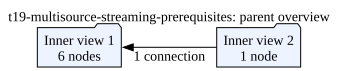

# T-19 Synapse multi-source and Disk Writer capability audit

**Date:** 2026-09-01  
**Status:** documentation audit complete; live-device capability spike remains required.

## Scope and evidence boundary

This audit assesses whether the proposed five-source topology can be supported
entirely on a SciFi-2: one 32-channel Omnetics broadband source plus four
independently rated wireless sources, optional application processing, and
on-device recording.

The public documentation is useful evidence of the intended interface, but it
does not replace validation on the target device and its installed API/firmware.
The repository pins `vendor/synapse-api` at `4c9e9c4` (v2.1.0 plus commits),
whereas the documentation is current as of this audit. `synapsectl` was not on
the current shell `PATH`, so the previously reported CLI/API version could not
be independently rechecked. The target at `192.168.100.157` replied to ICMP
from the host (`192.168.100.14`) but did not accept TCP port 650 on 2026-09-01.
No device configuration, recording, or deployment was changed.

## Result

The public interface supports branching DAG signal chains, Application nodes,
and Disk Writers attached to a compatible `BroadbandFrame` output. The current
Concepts documentation also says a signal chain may combine compatible inputs,
but it does not specify the fan-in semantics, ordering, source identity, or
clock behavior of a Disk Writer receiving multiple independent streams. The
checked-in protocol provides no stronger guarantee. A config-only writer for a
single coherent `BroadbandFrame` output is therefore a concrete candidate; an
all-on-SciFi five-source recorder remains a Phase-0 live-validation question,
with host-side normalization/recording as the fallback if the graph cannot
provide the required semantics.

## Configuration prerequisite: four sources must exist before four nodes can bind them

`DeviceConfiguration` creates `kBroadbandSource` *nodes*; it does not create
or clone `Peripheral` objects. Each source node selects a peripheral by its
device-assigned `peripheral_id`. The last recorded device inventory contains
one virtual recording source (ID 1000) and one virtual optical-stimulation
sink (ID 1001), alongside the Omnetics source. It therefore supplies only one
virtual broadband source, not four independently rated wireless sources.

Do not create executable `wireless_nodes.json` or
`rhd2132_plus_wireless_nodes.json` with speculative IDs, and do not bind four
nodes to ID 1000. First provision four independently enumerated virtual
`kBroadbandSource` peripherals (or demonstrate that the target firmware can
instantiate them), then obtain their actual IDs from `info`. At that point a
generator can emit both requested JSON files from that inventory without
hard-coding a peripheral ID.

The target configuration should have five independently streamable node
outputs. The current on-device App remains connected only to the Omnetics
reference source; the host subscribes to all five and performs fusion.

<!-- graphviz:docs/t19-multisource-streaming-prerequisites.dot -->

<!-- /graphviz:docs/t19-multisource-streaming-prerequisites.dot -->

An endpoint listed by `taps list` demonstrates that the device bound a ZeroMQ
Tap, not that the topology is usable. For every source, also stream data and
verify correct frame type, independent rate, source identity, monotonic
sequence/timestamps, and no unexpected gaps. That proves separate host
subscription only; it does not prove App multi-reader support, clock alignment,
or Disk Writer fan-in.

| Capability | Documentation and protocol evidence | T-19 disposition |
| --- | --- | --- |
| Multiple Application nodes in one chain | The concepts documentation permits a resource-constrained DAG; `NodeType` includes `kApplication`. | Candidate only. Configure two minimal instances and inspect `info`/logs. |
| App output as another node's source | Documentation says a Tap's data can be passed to another node and the SDK calls output taps node-facing. `NodeConnection` connects node IDs only. | Candidate only. Connect an App `BroadbandFrame` output to a second App and prove ordered frame receipt. |
| Multiple independent upstream readers in one App | The documented `setup_reader(node_id)` initializes the singular inherited `data_reader_`; the current App has exactly this shape. | Not supported by the documented interface. Do not implement the four wireless inputs in one App unless an SDK-supported multi-reader API is demonstrated. |
| Tap-name uniqueness | The SDK requires a named output tap but does not define whether names are device-global, App-instance scoped, or otherwise namespaced. | Unknown. Prove both unique names and intentional duplicate-name rejection. |
| One Disk Writer accepting multiple sources | Documentation says a Disk Writer accepts a compatible broadband-frame output, and Concepts says compatible inputs may be combined in a DAG. It does not document whether one Disk Writer accepts multiple upstream outputs, how frames are ordered, or how source identity is represented. The pinned `DiskWriterConfig` has only `filename`, and `NodeConnection` has no input-port or multiplexing fields. | Candidate only. Treat one-writer fan-in / one unified HDF5 file as unproven until a live configuration and output prove it. |
| Independent recording start/stop | Public lifecycle operations configure/start/stop the device chain. The pinned API exposes only device-wide `Start` and `Stop`; Disk Writer has no runtime command/configuration field. | Unsupported by the public control surface. Recording epochs must be host-controlled unless the target exposes a version-specific API. |
| On-device file provenance for four clock models | The documented writer stores one ordered broadband frame series and frame sequence/timestamps plus fixed channel metadata. | Insufficient for required per-source raw timing inputs, model epochs, `t_hat`, and uncertainty bounds. A host recorder is required even if individual source files can be written on-device. |

## What the documentation does establish

- Signal chains are directed acyclic graphs subject to device compatibility and
  resource validation; Taps may feed nodes, storage, or a client.
  ([Concepts](https://science.xyz/docs/d/synapse/concepts))
- An Application node receives connected inputs, creates readers in its C++
  code, and creates typed output taps. The public example documents the
  single-reader `setup_reader()` / `data_reader_` pattern.
  ([Synapse App SDK](https://science.xyz/docs/d/synapse/synapse-app-sdk))
- A Disk Writer accepts a `BroadbandFrame`-format output. Multiple Disk Writers
  can be used simultaneously, but the documentation does not define whether
  one writer is a fan-in sink. The documented HDF5 layout is a single
  frame-ordered series.
  ([Node reference and HDF5 layout](https://science.xyz/docs/d/synapse/node-reference))

## Required live spike when the device is available

Run each trial only against the target's queried peripheral IDs; do not use a
hard-coded ID. Save the exact configuration, `synapsectl info`, tap listing,
logs, status, and any generated HDF5 file for every trial.

1. Query `info`, storage devices, applications, API/firmware version, and
   available peripheral IDs. Re-run the installed `synapsectl --version` and
   contextual help from its active environment.
2. Configure two `kApplication` instances with unique tap names and prove both
   start, appear in status, and stream independently.
3. Configure a `BroadbandFrame`-producing App output into a downstream
   Application reader. Compare source and downstream sequence/timestamp
   continuity and record the actual tap naming rules.
4. Attempt a second reader in a single App only if the installed SDK presents a
   documented multi-reader API. Otherwise record this as rejected by interface
   design, rather than adding a custom workaround.
5. Attach one Disk Writer to each tested compatible broadband path; then try a
   deliberately bounded multi-input writer configuration. Verify whether it is
   rejected, accepted, or produces a lossless and unambiguous file. Inspect
   HDF5 schema, source identity, and file count.
6. While the chain is running, look for a documented per-node recording command
   in the installed CLI/API. If none exists, verify the only supported epoch
   boundary is device-wide stop/start and capture the resulting files.

Pass T-19 only if all claimed capabilities are demonstrated on the actual
target version. Even a successful separate-file Disk Writer result does not
replace T-20/T-21/T-26: the required aligned per-sample time and uncertainty
provenance belongs in the host fusion recorder.

## Repository-local protocol evidence

- `vendor/synapse-api/api/node.proto`: `NodeConnection` contains only
  `src_node_id` and `dst_node_id`; `kApplication` and `kDiskWriter` are node
  types.
- `vendor/synapse-api/api/nodes/application.proto`: application name and
  untyped parameter map only.
- `vendor/synapse-api/api/nodes/disk_writer.proto`: filename and storage-device
  ID configuration; status only.
- `vendor/synapse-api/api/synapse.proto`: device-wide `Start` and `Stop` RPCs.
- `apps/stateful-decode-and-sync/src/mode_switch_app.cpp`: one
  `setup_reader(kBroadbandNodeId)`, inherited `data_reader_`, and a
  `BroadbandFrame` producer tap.
