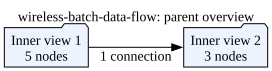

# WirelessBatch v1 contract

This is the shared boundary between an external phone/tablet/laptop gateway
and a wireless ingress reader. The canonical wire definition is
[`protocol/wireless/v1/wireless_batch.proto`](../protocol/wireless/v1/wireless_batch.proto).
The receiver configuration is defined by
[`config/wireless-gateway.schema.json`](../config/wireless-gateway.schema.json),
with a concrete example in
[`config/wireless-gateway.example.json`](../config/wireless-gateway.example.json).

## Transport envelope

The v1 ZeroMQ transport is a `PUB` sender and `SUB` reader. Every publication
has exactly two frames:

1. UTF-8 topic, normally `wireless/v1/<source_id>`;
2. serialized `sciencexyz.wireless.v1.WirelessBatch` protobuf bytes.

The receiver connects to one or more configured endpoints for one logical
source. A production endpoint is `tcp://<gateway-lan-address>:<port>`; `ipc`
and `inproc` are reserved for same-host tests. The topic is an exact
subscription, not a wildcard. Endpoint, topic, and source identity are
configuration data, not values inferred from a received payload.

The gateway must bind on a LAN-reachable address (usually
`tcp://0.0.0.0:<port>` or its LAN interface), while the reader connects to the
gateway's actual Wi-Fi/LAN address. `localhost` is only valid when both ends
run on the same machine.

## Payload and identity rules

`contract_version` is `1`. `source_id` is a stable configured logical identity;
`boot_session_id` changes on every source restart or acquisition reset.
`batch_sequence` is monotonic within a boot session. `first_sample_sequence`
and `sample_count` identify contiguous source samples. A batch's payload is
little-endian, row-major, sample-major, channel-interleaved data with shape
`[sample_count, channel_count]`. v1 supports `INT16_LE`, `INT32_LE`, and
`FLOAT32_LE`; there is no implicit compression or scaling.

The receiver checks the payload byte length, shape, format, channel descriptor
indices, source identity, rational rate, and session/sequence continuity. It
preserves the payload and all metadata exactly as received. A payload SHA-256,
when present, covers only `payload`.

`first_source_tick` is the native acquisition anchor for the first sample.
`source_tick_frequency_*` describes that clock. `source_acquisition_time_ns`
is optional and is interpreted only with `source_time_domain`. The gateway's
`gateway_receive_time_ns` and `gateway_send_time_ns` are local gateway clock
stamps. They are not App or host receipt times and must not replace source
timestamps.

## Diagnostics and loss policy

The receiver keeps separate diagnostics for:

* sender-reported drops in `sender_gap`;
* missing, duplicate, or reordered `batch_sequence` values observed at the
  reader;
* missing or non-contiguous sample sequences;
* malformed/rejected batches;
* PUB/SUB disconnect, reconnect, and subscription startup intervals;
* bounded mux/normalization queue overflow.

A sequence gap is never silently interpolated, resampled, or discarded. The
default policy is `diagnose_and_preserve`: retain the valid batch, mark the
gap, and make it visible to the recorder/fusion stage. A receiver may instead
reject a source after a gap, but that is an explicit configured policy. A
duplicate or replay is deduplicated only using `(boot_session_id,
batch_sequence)` and is still counted. A new boot session starts a new clock
and sequence epoch; it is never stitched to the old one without an explicit
resynchronization record.

Hard rejection is required for an unsupported contract version, malformed
protobuf, wrong configured source/topic, invalid or zero rate denominator,
invalid shape, unsupported format, payload length mismatch, or batch exceeding
configured limits. Missing source time, gateway-only timestamps, sequence gaps,
and reconnects are degraded/unbounded synchronization conditions—not reasons
to manufacture timestamps.

The reconciliation boundary is host fusion, before any alignment or
resampling. Raw source clocks, gateway stamps, App receipt stamps, host receipt
stamps, sequence numbers, and diagnostics remain independently recorded.

## Clock cases

Same-process/loopback tests may compare a single monotonic clock, but must keep
the fields distinct to exercise the real metadata path. Same-host gateway and
reader clocks can be compared only when they explicitly identify the same
clock domain. Across LAN hosts or operating systems, estimate an affine map
`t_ref = a * t_source + b` and persist its epoch, residuals, drift, and
uncertainty. If wireless hardware provides no source clock or acquisition
anchor, the stream is sequence-accounted but synchronization is unbounded
until an external calibration establishes a bound.

The receiver is an App-owned, round-robin, nonblocking mux in the initial
spike. Each reader/socket has exactly one owner. If this cannot meet throughput,
the permitted evolution is one owner thread per socket feeding a bounded,
loss-accounted queue to one normalization/fusion owner.

<!-- graphviz:docs/wireless-batch-data-flow.dot -->

<!-- /graphviz:docs/wireless-batch-data-flow.dot -->
