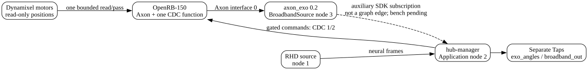

# NML Hand Exo angle source

Driver **0.3.0** advertises a real `kBroadbandSource` backed by measured OpenRB
motor positions, currents, and derived torque. It requires the matching
`EXO_AXON_USB=1` firmware in `third_party/exo/src/cpp/nml_hand_exo`. No FPGA
toolchain or gateware is needed. Its serial version response identifies it as
`0.7.1-axon-0.3.0`. The driver and firmware are a matched pair: 0.3.0 uses the
8-field `0xF212` telemetry schema and refuses the older 4-field `0xF211`
firmware at the start-time handshake (and vice versa).

## USB and graph

<!-- graphviz:firmware/axon-exo/angle-source.dot -->

<!-- /graphviz:firmware/axon-exo/angle-source.dot -->

There is **one CDC serial function**, consisting of control interface 1 and
data interface 2. Vendor interface 0 carries Axon discovery and angle polling.
The default firmware without EXO_AXON_USB retains two CDC serial functions.

The server owns Axon; the App owns CDC commands. The plugin never opens CDC,
enables torque, homes a motor or changes its operating mode. Existing App
motion/raw gates remain default-off; the tracked config enables them only for
supervised bench operation. Firmware's existing startup behavior still applies.

`rhd2132_with_exo.json` connects only neural source node 1 to App node 2.
Synapse 2.4.1 rejects a second incoming graph edge, and the App SDK asserts
exactly one application node, so the Exo source cannot feed the App through the
graph. Exo source node 3 stays configured without an outgoing edge; the App reads
its telemetry from the source node's **own** producer tap
(`broadband_source_<node_id>`), which the server publishes for every configured
BroadbandSource. The App resolves that tap's endpoint from the device tap
registry (a PUB at `ipc:///tmp/tap_registry` that broadcasts the tap list ~1/s),
then subscribes a dedicated reader; `exo_source_node_id: 3` selects which source.
Its frames are forwarded unchanged to the App's `exo_angles` tap and never enter
neural decimation, MPF features or the classifier. (The earlier
`setup_reader(node_id)` approach does not work for an edgeless node — it resolves
only graph-connected inputs and yields a reader subscribed to nothing; see
`MISTAKES.md` 2026-09-13.) Rebuild/redeploy the App after this change. CDC remains
selected by `exo_usb_control_interface: 1`, with optional `exo_usb_serial`
disambiguation.

Hardware dispatch type **0xF002** is distinct from the runtime peripheral ID.
The operator's 2026-09-11 capture reported RHD ID **200**, Exo ID **300** and App
Running True. These observed IDs populate the example; replace them from fresh
`synapsectl -u "$DEV" info` evidence if they change. No runtime ID is compiled
into firmware or driver. Merely registering a peripheral does not create a node.

## Channels and timestamps

Select complete groups of **eight** channels per motor. `id` is the sequential
stream index; `electrode_id = 8 * Dynamixel_ID + field` selects the motor/field.
The example uses IDs 11..19 from the right-hand firmware, 72 channels, 10 Hz
nominal polling, 16 bits, unity gain and no analog filters. Supported polling
rates are integer 1..20 Hz, with 1..18 distinct motors. This is the driver
**0.3.0** / firmware `axon-0.3.0` schema (reply type `0xF212`); the earlier 0.2.0
/ `0xF211` layout had only fields 0..3.

| Field | Meaning |
|---|---|
| 0 | Signed absolute encoder angle in **0.1 degree**; -32768 means unavailable |
| 1 | Low 16 bits of source sample age in milliseconds (unsigned bit pattern) |
| 2 | High 16 bits of source sample age in milliseconds (unsigned bit pattern) |
| 3 | Angle status: 0 measured, 1 unavailable/read error/out of range/**not controlled in this mode** |
| 4 | `PRESENT_CURRENT` in **milliamps** (signed int16); 0 when unavailable |
| 5 | Current status: 0 measured, 1 unavailable/read error/**not controlled in this mode** |
| 6 | Low 16 bits of derived torque as little-endian **float32 N·m** |
| 7 | High 16 bits of that float32; the pair is `0xFFFFFFFF` (NaN) when invalid |

Reconstruct torque as a float from fields 6 (low) and 7 (high):
`bits = uint16(f6) | uint16(f7) << 16`, then reinterpret `bits` as float32.
Torque is derived on the device from the same current sample
(`N·m = mA × 0.00115`, the XC330-T288 constant); it issues no extra bus read, so
its validity follows field 5.

### Field validity depends on the active control mode

The angle and current registers physically read in every Dynamixel operating
mode, but a value is only a **controlled/commanded** quantity in a mode that
drives it. The firmware stamps the status fields accordingly (symmetric), so a
consumer never mistakes an uncontrolled-but-readable register for a measurement:

| Control mode | Angle (field 3) | Current/torque (fields 5–7) |
|---|---|---|
| `POSITION` | measured | **unavailable** |
| `CURRENT_POSITION` | measured | measured |
| `VELOCITY` | **unavailable** | **unavailable** |
| `CURRENT` | **unavailable** | measured |
| `DISABLED`/unknown | **unavailable** | **unavailable** |

The stamping is keyed off the firmware's single tracked control mode
(`motorControlMode_`), which every motor shares. It is decided at the source (the
OpenRB firmware), so the decoder/probe and the host need no mode logic — they
already honor the per-field status bits. The example so far runs
`CURRENT_POSITION` (all fields valid), which is why current/torque have been
observed alongside angle.

These are motor encoder positions and motor currents, **not anatomical joint
angles or the six gesture percentages**. Multiple turns are retained up to the
representable range (-3276.7..3276.7 degrees); out-of-range values are explicitly
unavailable. Firmware rounds encoder ticks to 0.1 degree. No interpolation,
hold-last-value substitution or invented zero is used for an offline motor.

The SDK channel schema only has ELECTRODE/GPIO; ELECTRODE here is the numeric
container, not a claim that these values are microvolts. `get_lsb=1` preserves
the mixed raw fields. Use the dedicated decoder/probe below, not voltage labels
or neural filtering. Keep this channel mapping with recordings.

`timestamp_ns` is OpenRB snapshot uptime in ns, extended across millis rollover.
Each motor read's source start time is exactly snapshot time minus its 32-bit
age in ms. Reads are sequential, not simultaneous; each position transaction
has a 2ms timeout. `unix_timestamp_ns` carries **SciFi host steady receipt ns**
for this source, following the App's receipt-field convention; it is not UTC.
The outer source packet sequence is preserved (discovery also consumes sequence
numbers). Alignment with neural/SciFi time is **unknown**, not synchronized.
Do not subtract these clock domains without an explicit alignment stage.

## Scheduling and failure behavior

The driver owns a polling thread with all its ZMQ sockets on that thread. One
read-only request is outstanding at a time, with a token rejecting stale
replies and a 250ms timeout. Start requires a real matching response within
1.5 seconds; missing/incompatible firmware fails clearly. Invalid motor values
still yield status-bearing frames. `read_frames` drains a bounded 128-frame
queue without waiting for hardware; overflow and request timeouts are logged.
Polling stops/join completes on stop/destruction. Requested rate is nominal;
missed deadlines are not filled with synthetic samples.

On the MCU, one motor read occurs per loop pass (2ms timeout). This is bounded
cooperative polling, not a wait-free motor bus. Existing command/governor work
can add latency. USB output advances at most one 64-byte chunk per pass only
when its bank is free, avoiding the core's 70ms previous-transfer wait.

## Build locally

From repository root in Windows PowerShell:

```powershell
arduino-cli compile --fqbn OpenRB-150:samd:OpenRB-150 --clean --build-property 'compiler.cpp.extra_flags=-DEXO_AXON_USB=1' --output-dir firmware/axon-exo/dist/openrb third_party/exo/src/cpp/nml_hand_exo
```

To deploy the built arduino binary:  
```powershell
arduino-cli upload --fqbn OpenRB-150:samd:OpenRB-150 --port COM21 --input-file firmware/axon-exo/dist/openrb/nml_hand_exo.ino.bin --verify
```

For the SciFi-2 device deriver:  
```powershell
docker build --no-cache -t axon-exo-builder -f firmware/axon-exo/Dockerfile firmware/axon-exo
```
and then mount the built driver in the docker container:  
```powershell
docker run --rm --mount "type=bind,source=$((Get-Location).Path)/firmware/axon-exo,target=/work" axon-exo-builder bash build-driver.sh
```

The Dockerfile extends the existing hub-manager builder and installs SDK 0.2.0,
ABI 3. Outputs: `dist/openrb/nml_hand_exo.ino.bin`, `build/axon_exo.so`,
`build/scifi-axon-exo_0.3.0_arm64.deb`. The package privately bundles the SDK at
`/usr/lib/scifi/axon-exo/`; its relative RUNPATH avoids overwriting another
plugin's files. All server plugins must still use compatible SDK ABIs/SONAMEs.
The underscore-separated Debian filename is required by the deployment client.

## Operator deployment

1. Keep the mechanism unloaded; use the normal supervised stop/disarm procedure.
2. Retain the [three-VID server patch](../../docs/axon-usb-enumeration-proof.md),
   which preserves Science 399A and RHD 2AC1 while adding ROBOTIS 2F5D.
3. Flash the new firmware. From PowerShell, first use `arduino-cli board list`,
   then substitute the actual upload port:

   ```powershell
   arduino-cli upload --fqbn OpenRB-150:samd:OpenRB-150 --port COM21 --input-file firmware/axon-exo/dist/openrb/nml_hand_exo.ino.bin --verify
   ```

4. Install the new driver, from WSL repository root:

   ```bash
   synapsectl -u "$DEV" peripherals deploy driver --package "$(pwd)/firmware/axon-exo/build/scifi-axon-exo_0.3.0_arm64.deb"
   ```

5. Rebuild/package/redeploy the App using its normal documented workflow.
   Refresh the local editable Python client/restart `gui-exo` as needed.
6. Fetch fresh `info`, check the Exo now reports `kBroadbandSource`, update the
   config's runtime IDs, then start `rhd2132_with_exo.json`. The new source
   requires the matching firmware; the old discovery-only firmware cannot start it.
7. Confirm both source nodes and App Running True. Read the stream independently
   of USB command connection (PowerShell):

   ```powershell
   python apps/scifi2-hub-manager/client/exo_angles_probe.py --device-ip 192.168.100.157 --config apps/scifi2-hub-manager/config/rhd2132_with_exo.json --duration 10
   ```

   If the probe reports no frames, the App now logs whether it is draining node 3
   at all. Fetch `synapsectl -u "$DEV" logs` and look for an `Exo receive
   diagnostics: ... forwarded_frames=N ... totals(... messages=M forwarded=F ...)`
   line, emitted at least once per second regardless of traffic. `messages=0`
   forever means the App's auxiliary reader is not receiving node-3 frames from
   the server (compare against a server-side `Exo N queue overflow` line, which
   would show the driver *is* producing into the server queue but the App is not
   consuming it); `messages>0, forwarded=0` points at the publish/decode side.
   This separates a driver/server-publication fault from an App-drain fault; the
   neural `Broadband receive diagnostics` line only covers node 1.

8. In `gui-exo`, Connect then Version. Check terminal `version` and `info;`,
   disconnect/reconnect, and verify neural acquisition continues. Physical
   motion/watchdog acceptance remains separate supervised bench work.

The latest supplied log confirms discovery and App Running True, but CDC
handshake silence. The GUI now recreates Tap connections before Connect and
waits for a correlated state response, fixing reuse of stale App endpoints after
restart. CDC open also explicitly clears then asserts DTR at normal baud.
These are local fixes, **not proof the observed board silence is resolved**.
If silence persists after the matched deployment, capture the fresh Connect
error. A board power-cycle/replug is operator work and can distinguish stale
board USB state. Do not infer success from the historical July log tail.

## Local tests

Driver tests load the actual ARM64 plugin under QEMU with fake Axon PUB/SUB,
checking source time, valid/missing motors, stale tokens, restart and teardown.
Firmware transport tests compile the actual USB module against minimal USB
stubs, checking fragmented framing, bounded sampling and discovery isolation.
Python tests cover decoding and GUI Tap reconnection. None actuates hardware.

Run `tests/run-local.sh` in WSL from repository root for the firmware/CDC tests;
build and run `build/axon_exo_plugin_test` under QEMU in the builder for the
plugin tests. Bench stream timing, clock alignment, acquisition continuity and
CDC recovery remain unverified until operator acceptance.
