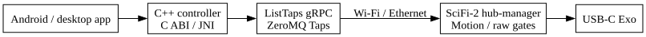

# Portable Exo control SDK

C++17 controller, C ABI and Java/JNI client for the SciFi-2 hub-manager Exo
control Taps. The host uses Wi-Fi/Ethernet; SciFi-2 owns the USB connection.
See [porting instructions](docs/porting.md) for builds and repository transfer,
and the [buildability report](docs/buildability.md) for the audit and verification.

Use one background owner thread for each client, including creation and close.
Call poll periodically for state updates. Device-side exo_motion_enabled and
exo_raw_enabled remain authoritative; failures propagate unchanged. No command
starts/configures the device. Motion/raw are supervised bench operations.
Disconnect attempts OFF before closing if this client may have engaged the hand.
Always call explicit disconnect/close and report failures; destructor cleanup
cannot guarantee disarm after network loss or process termination.

<!-- graphviz:host/exo_control/docs/architecture.dot -->

<!-- /graphviz:host/exo_control/docs/architecture.dot -->
